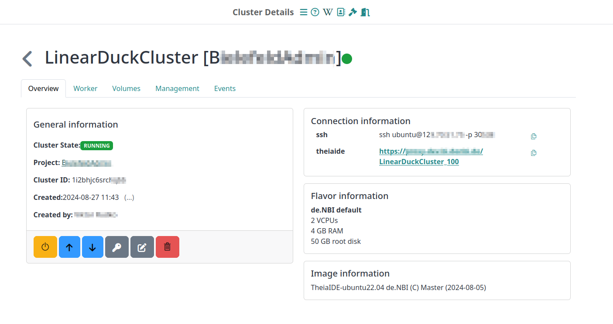
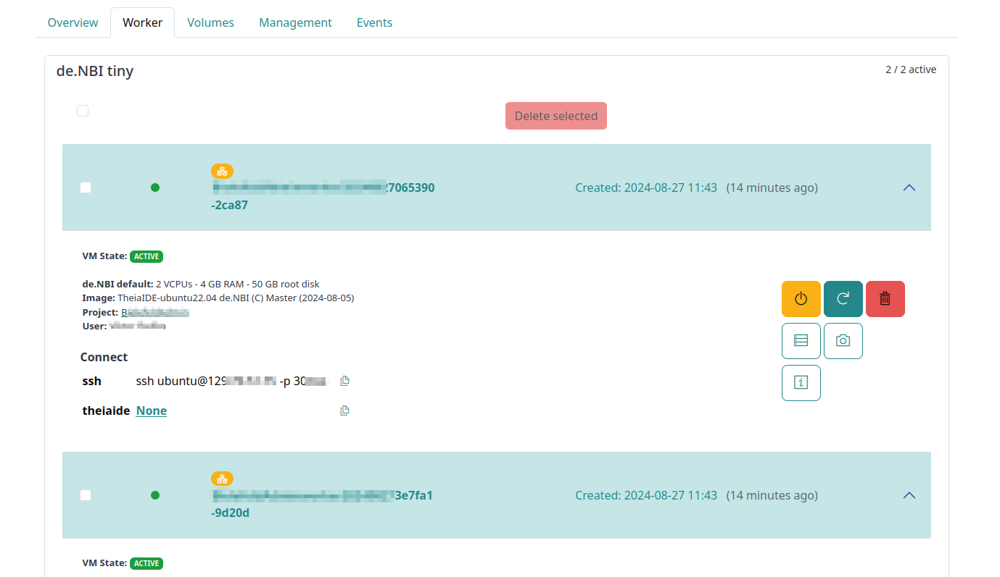

# Cluster detail

The detail page of your cluster offers more information about your cluster and its nodes.

## General information and actions

The general information part shows you:

- The name of your cluster.
- The general status of your cluster.
- Who created your cluster and when.
- Which project your cluster belongs to.
- The image and flavor of your master node.
- How you can connect to your cluster. The information differs depending on your configuration. It shows how to connect to the master node.

Further, you can take the following actions:

- Shutting your cluster off or restarting it, when it is shutdown
- Scaling-Up and Scaling-Down of the cluster as described for the [Cluster Overview](./cluster_overview.md) page. Same hods for the password generation
- Rename your cluster
- Delete your cluster by clicking `Delete Cluster`.

## Worker nodes

The worker nodes part shows you a listing of the worker nodes by batches.
In detail one can see:
- The relation of active workers to total workers for a batch
- The worker node names
- Who created the worker node and when.
- Which project your worker node belongs to.
- The connection information for the worker nodes

Further, you can take actions as for each instance on the [instance-detail page](../Instance/instance_detail.md).

## Additional information

Similar to the functions delivered on the instance detail page for single virtual machines one call also get information on the following aspects:

- Volumes
- Installed Conda packages and corresponding logs
- User Management 
- Cluster Event logs