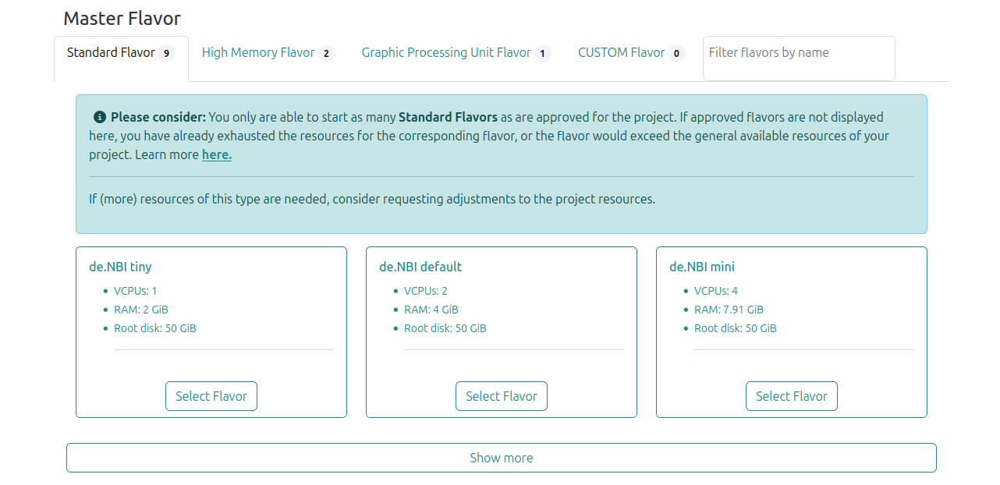
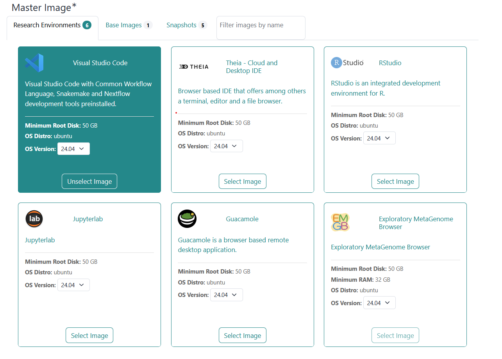
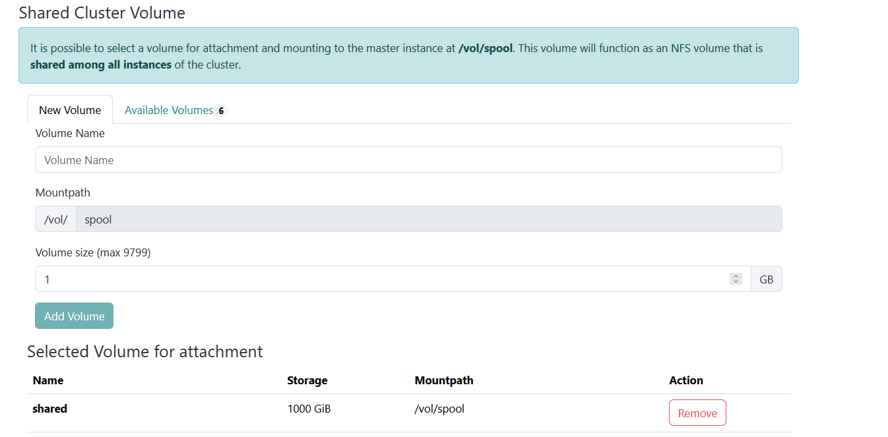
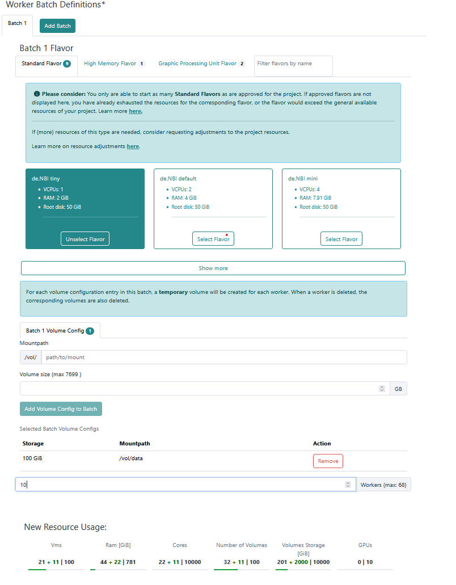
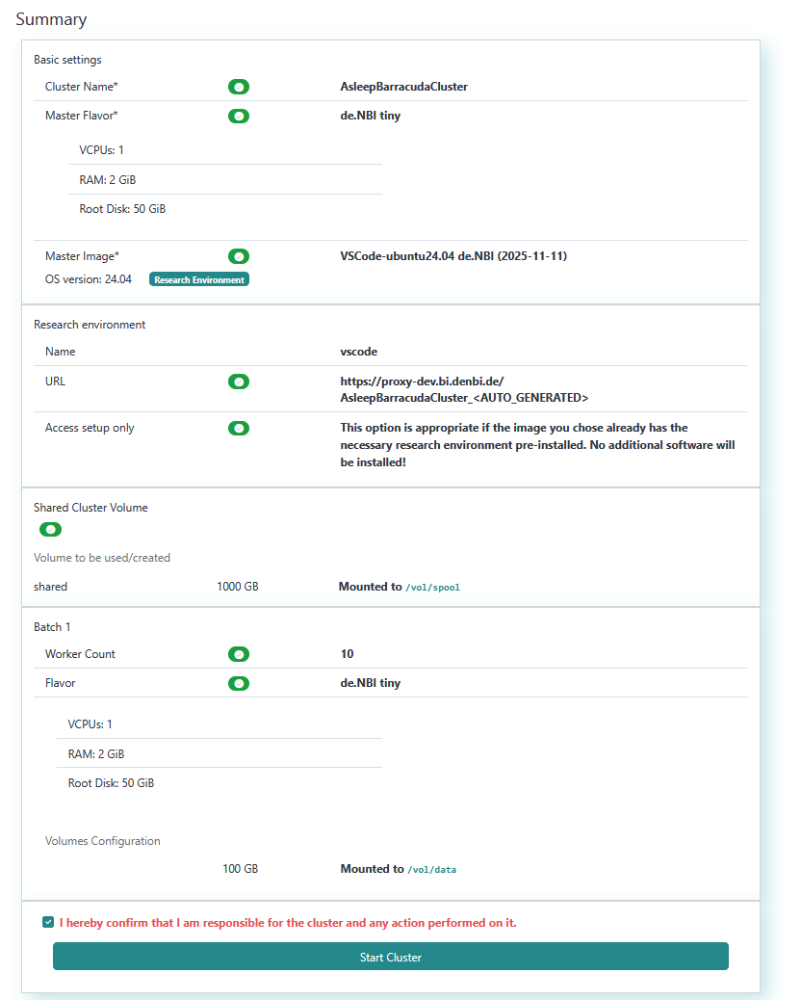

# Start a new cluster

To start a cluster, you need to belong to a SimpleVM project with activated cluster feature.
If you can't see the “New Cluster” button in the sidebar on the left, you either need to reload the page,
or you don't belong to a SimpleVM project.

A message informs you if you can't start a cluster. This can happen if:

- You haven't enough resources:
    - Delete running virtual machines or clusters to free resources.
    - An administrator of your project can request more resources.
- Members of your project may not launch virtual machines:
    - Ask an administrator of your project to start a cluster for you.
    - Ask an administrator of your project to change the appropriate setting.

Basically, the handling of starting a new cluster is similar to that of a [single instance](../Instance/create_instance.md).

## Resource overview

This line shows the resources used in your project, and the resources available. 
If you can't start a new cluster because you haven't enough resources, have an administrator of your
project request more resources.

## Name your cluster

Name your cluster here or generate a random name.
If the name already exists, a unique ID appends to the name after starting your cluster.

## Select a master flavor

Choose the flavor of your master node.
Click on a tab to switch between flavor types or use the filter to search by name.
A flavor sets the resources of your virtual machine. 

### About ephemeral flavors

Ephemeral flavors offer extra disk space.
That extra disk space mounts to the virtual machine when it starts and offers faster access than a volume. 
Contrary to a volume, data on an ephemeral don't remain when you delete your virtual machine.
Data on an ephemeral remain when you reboot or pause your vm.
Further, snapshotting a vm doesn't persist data from an ephemeral. 
Therefore, you should use ephemeral storage for temporary data that often changes
(e.g. cache, buffers, or session data) or data often replicated across your environment.
If you need to persist data from an ephemeral, create a backup on a volume.
See the [Best practices for data backup](../backup.md) wiki page for more information.

???+ danger "Backup important data from an ephemeral"
    Ephemeral storage is a fleeting storage.
    All data will be irretrievably lost when you delete your vm.
    If you need to persist data from an ephemeral, create a backup on a volume.
    See the [Best practices for data backup](../backup.md) wiki page for more information.

## Select an image

Choose the image all your nodes start with.
An image includes the operating system and tool packages installed on your vm. 
You may choose between base images provided by de.NBI, pre-build images containing a Research Environment
provided by de.NBI, or one of your snapshots.
Click on a tab to switch between them or use the filter to search by name. 
For more information about images and snapshots, see [Images and snapshots](../snapshots.md).

???+ info "Worker node image"
    All your worker nodes start with the same image you choose for your master node.

## (Optional) Shared Cluster Volume

You can create a new volume or select an existing one.  
This volume will be shared between your master and worker nodes as an NFS share, mounted at `/vol/spool`.

## Worker Batch Definitions

A worker batch bundles all worker nodes of the same flavor.
You can have as many batches as you have resources and flavors available. 

### Batch Tabs

- Each batch can be configured separately.
- Use the **Add Batch** button to create additional batches.

### Batch Flavor Selection

- Choose a flavor for each batch: **Standard**, **High Memory**, or **GPU** flavors.
- Each flavor shows its specifications:
  - **vCPUs**
  - **RAM**
  - **Root disk size**
- **Note:** You can only select flavors approved for your project. If a flavor is not displayed, resources may be exhausted or unavailable. Consider requesting adjustments if more resources are needed.

### Volume Configuration

- For each batch, you can define temporary volumes that are mounted on each worker:
  - Specify the **mount path** (e.g., `/vol/data`)
  - Specify the **volume size**
- For every volume configuration entry in the batch, a **temporary volume** is created for each worker.
- When a worker is deleted, its corresponding volumes are automatically removed.

### Selected Batch Volume Configs

- Lists the volumes added to the batch with their **storage size** and **mount path**.
- Volumes can be removed with the **Remove** action.

### Worker Count

- Specify the number of workers in the batch (max depends on available resources).

### Resource Usage Summary

- Shows the currently used resources and the additional resources required for the current cluster configuration
  - **VMs**
  - **RAM [GiB]**
  - **CPU cores**
  - **Number of volumes**
  - **Volume storage [GiB]**
  - **GPUs**

## Grant access for members

Like for the start of a [single instance](../Instance/create_instance.md) one can also grant access to the machine for other members of the project the cluster gets started in.

## Start your cluster

Read and confirm the acknowledgments and start your cluster. 
After a short time, the page redirects you to the [Cluster Overview](./cluster_overview.md) page.
