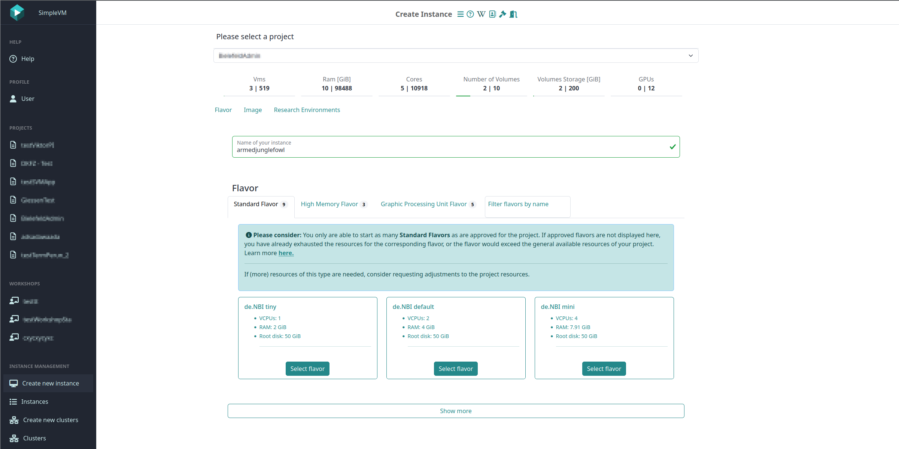
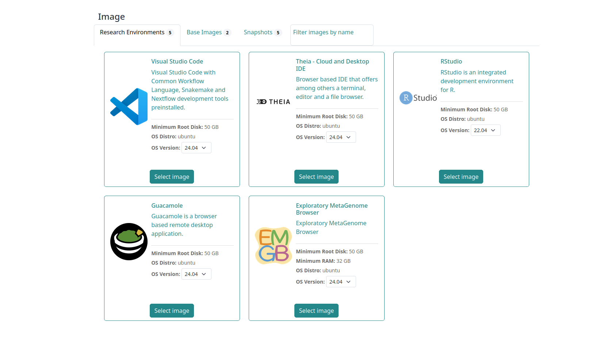
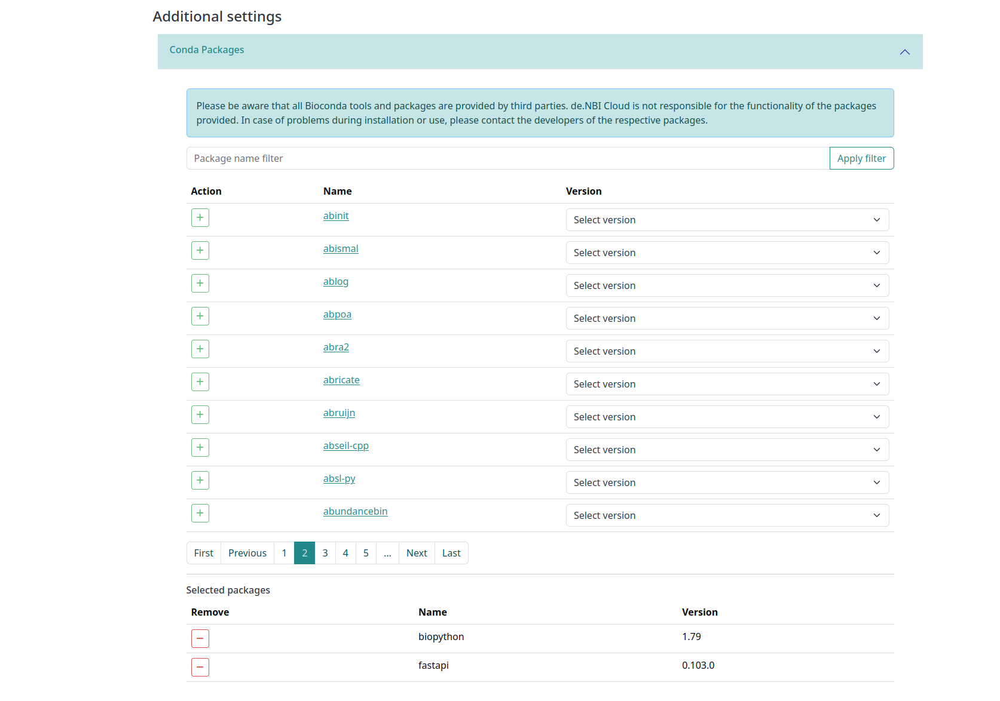
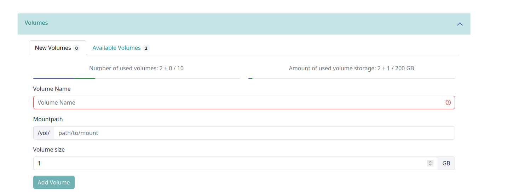
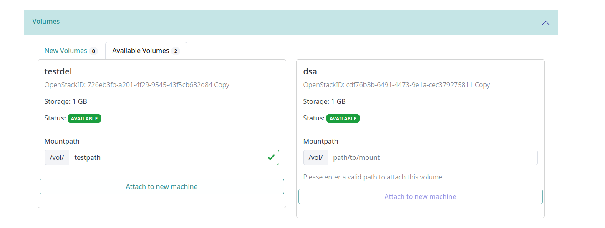
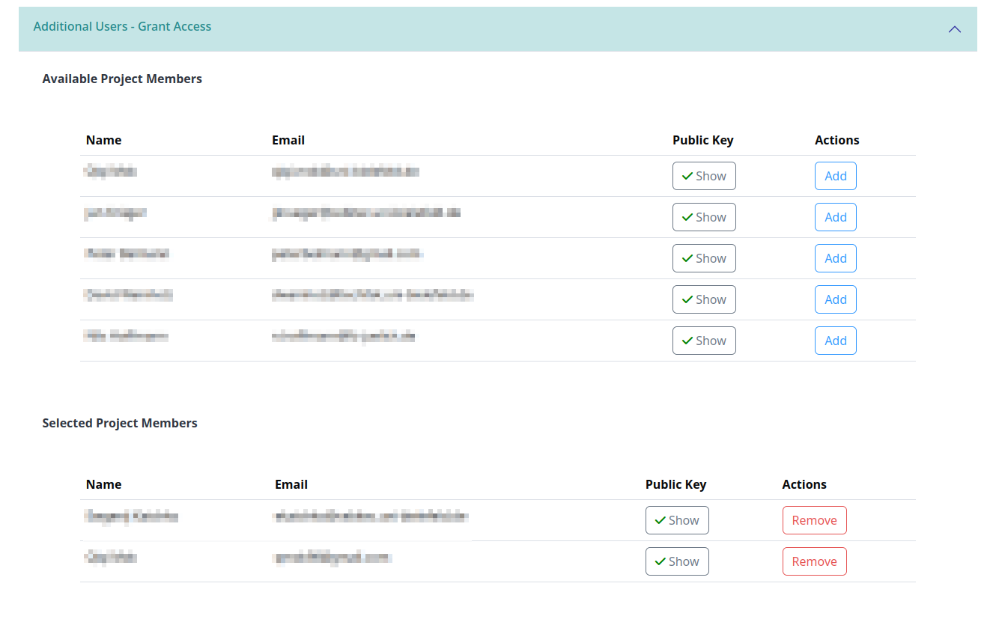
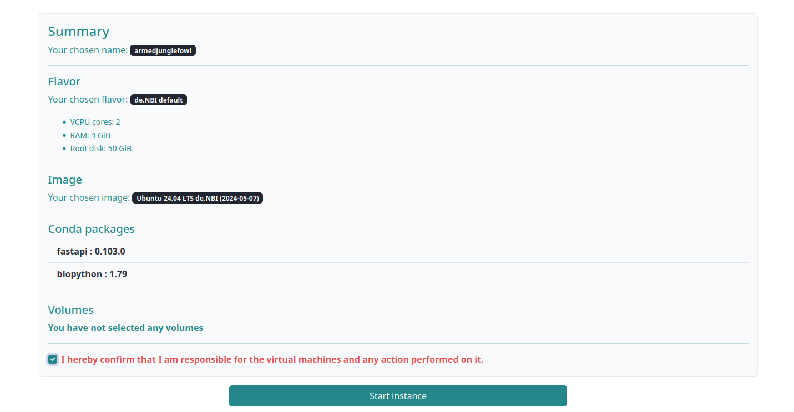

# Starting a virtual machine

To start a virtual machine, you need to be a member of a SimpleVM project.
If you can't see the "Create Instance” menu item in the sidebar on the left, you either need to reload the page, you are not member of a SimpleVM project or the administrators of the project do not allow non-administrators to start machines on their own.

In case you are part of a SimpleVM-project and have the corresponding rights to start a machine, conditions can lead to the case, that starting of virtual machines for a certain project is not possible. This can happen if:

- The resources of a project are used up:
    - Delete running virtual machines to free resources.
    - An administrator of your project can request more resources. 

In case you are a member of a project but are not allowed to start machines:

- Ask an administrator of your project to start a virtual machine for you.
- Ask an administrator of your project to change the appropriate setting.

## Machine configuration

There are some choices to be made when starting a machine.
Some of the inputs are necessary, others are optional. 
The information that is mandatory for starting a machine is, in addition to the selection of the project in which the machine is to be started, the name of the machine, a flavor and an image.
The available options are listed and explained below.

### Selected project

This select shows the selected project for which you want to start a new virtual machine and only shows when
you belong to more than one project. In case you are only member of a single project, the corresponding project is selected automatically.

### Used and allocated resources

This area shows the resources used in your project.

### Name your virtual machine

Name your virtual machine here or generate a random name. 
After starting your virtual machine, a unique ID appends to the name.

### Flavor selection

Choose the flavor of your virtual machine.
Click on a tab to switch between flavor types or use the filter to search by name.
A flavor sets the resources of your virtual machine.

#### About ephemeral flavors

Ephemeral flavors offer extra disk space. 
That extra disk space mounts to the virtual machine when it starts and offers faster access than a volume. 
Contrary to a volume, data on an ephemeral don't remain when you delete your virtual machine.
Data on an ephemeral remain when you reboot or pause your vm.
Further, snapshotting a vm doesn't persist data from an ephemeral. 
Therefore, you should use ephemeral storage for temporary data that often changes
(e.g. cache, buffers, or session data) or data often replicated across your environment.
If you need to persist data from an ephemeral, create a backup on a volume.
See the [Best practices for data backup](../backup.md) wiki page for more information. 
Use [Volumes](#8-volumes) for data that must persist.

???+ danger "Backup important data from an ephemeral"
    Ephemeral storage is a fleeting storage. 
    All data will be irretrievably lost when you delete your vm.
    If you need to persist any data from an ephemeral, [create a backup on a volume](../backup.md).

### Image selection

Choose the image your virtual machine starts with.
An image includes the operating system and tool packages installed on your vm. 
You may choose between base images provided by de.NBI, pre-build images containing a Research Environment
provided by de.NBI, or one of your snapshots.
Click on a tab to switch between them or use the filter to search by name. 
For more information about images and snapshots, see [Images and Snapshots](../snapshots.md).

#### Research Environments

In case you have chosen an base image, you are able to choose Research Environment to be installed on your machine manually.
It will take longer than choosing an image with an preinstalled Research Environment.
Find more information on Browser-based Research Environments [here](../customization.md#research-environments).

### Additional settings

#### Conda tools

You may choose conda, bioconda, and anaconda tools, which install on your machine at launch.
To add a tool, you may filter by name, and click the green plus button. 
For more information, see the [customization wiki page](../customization.md#conda).

#### Volumes

Create, attach, and mount a new volume or attach and mount an already existing volume to the machine.
When creating a new volume you can choose the name, the path it gets mounted to and a volume size in GB.
If you want to know more about volumes, see the [Volumes](../volumes.md) wiki page.
You will see a selection of volumes which are queued for creation and existing volumes you have chosen for attachment below. 

#### Grant access for project members

Grant members of your project SSH access to your virtual machine. 
You can't grant access to members without an SSH key stored in the portal.
The column “Public Key Set” displays whether they have an SSH key stored.
Each granted member can access your virtual machine with their respective private key.

???+ info "Granted members and permissions"
    All users connected to your vm have the same permissions and don't have separate home directories. 
    Only the person who initially started the machine can stop, restart, or delete it.

### Summary and Start

At the end of the Create-Instance form you get an overview of all selections made by you. 
When every necessary settings are given, you are able to initiate the start of the virtual machine by clicking on "Start instance".
You are otherwise informed of this by corresponding messages in the summary.
After a short time, the page redirects you to the [Instance Overview](./instance_overview.md) page.

## Restrictions on the choice of resources  

Certain resources, such as GPU flavors or high-memory flavors, are subject to certain restrictions.
This is due to the scarcity of these resources.

GPUs are in high demand in the cloud environment. To enable all users in SimpleVM who require these resources to access them, it is important to only provide projects with the GPU resources that are assigned to the project.

The same applies to flavors such as those of the high-memory type.
The scarcity of this resource is due to the cloud technology as such. Flavors of this type occupy large areas of individual physical machines. This severely limits the computing capacities, particularly in the area of RAM for these individual physical machines.

In order to meet all project requirements of all projects that use SimpleVM as comprehensively as possible, only the assigned flavors can be used by flavors of these types. With standard flavors, on the other hand, only the overall resource restrictions of the respective project apply.

Please bear this in mind for all resources, regardless of the limitation:
Only use them for as long as you need them. If a machine is not needed, for example because it is idle, create a snapshot of the machine and delete it.
You can then use the snapshot to start a new machine when the resource is needed again. This prevents unnecessary use of resources. When deleting machines, please also consider the notes on [backups and persistence of data](../backup.md).