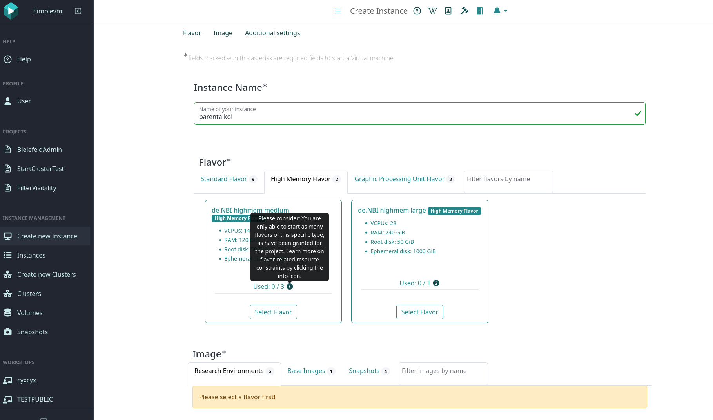
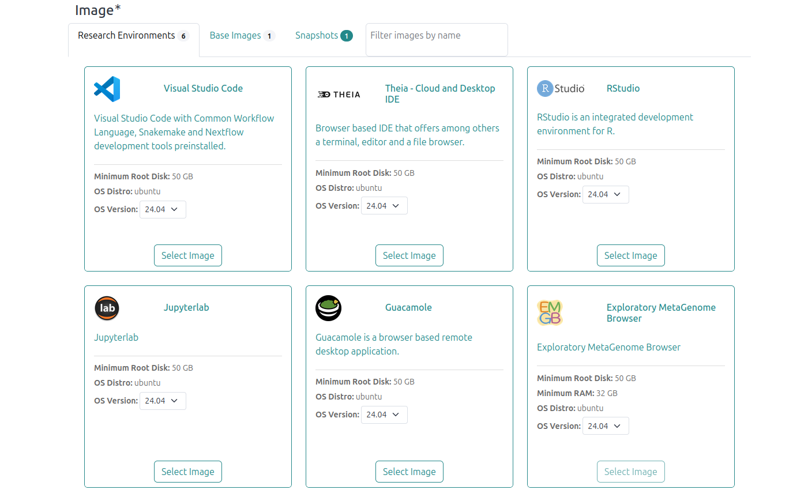
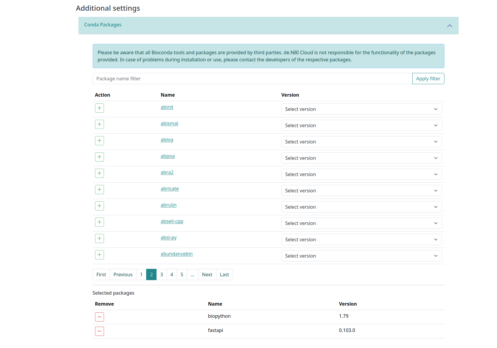
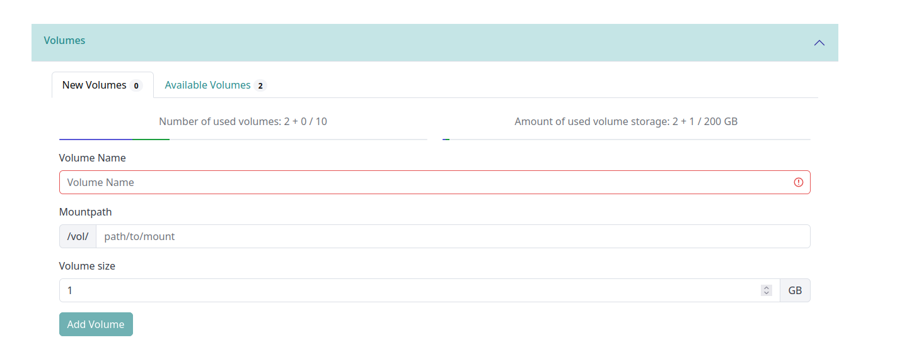
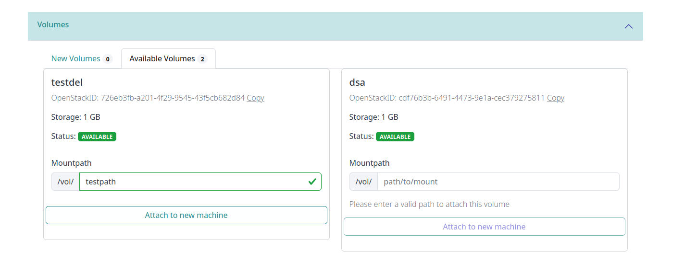
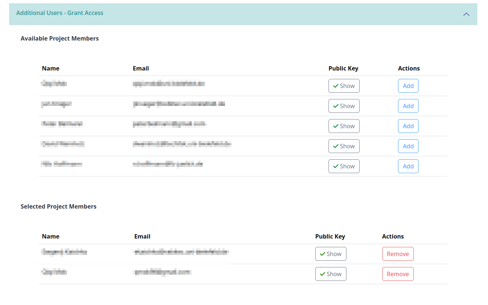
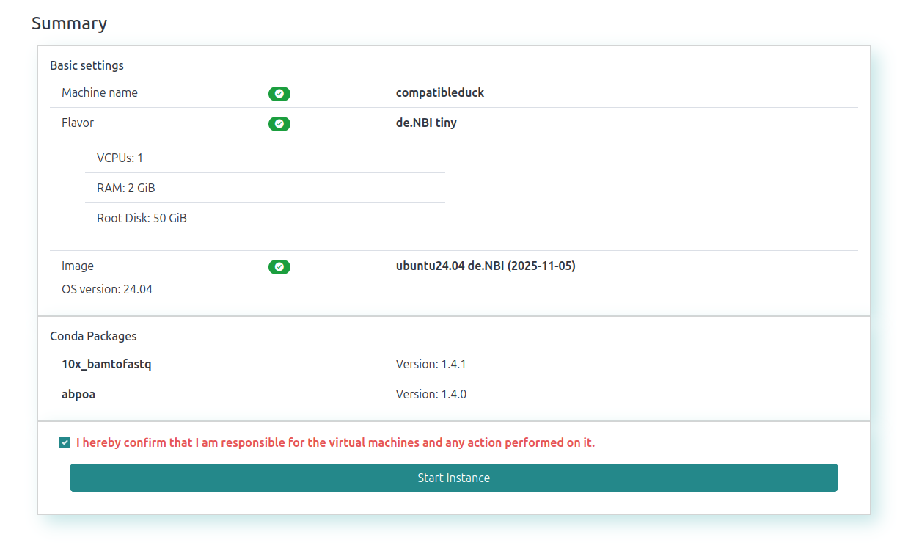

# Starting a virtual machine

???+ warning "Unix name"
You can only start virtual machines with a valid unix name. You can configure and confirm your unix name
in your profile page. This name is used as username for all virtual machines which you have access to,
either created by yourself or granted access by another user.

To start a virtual machine, you need to be a member of a SimpleVM project.
If you can't see the "Create Instance” menu item in the sidebar on the left, you either need to reload the page, you are not member of a SimpleVM project or the administrators of the project do not allow non-administrators to start machines on their own.

In case you are part of a SimpleVM-project and have the corresponding rights to start a machine, conditions can lead to the case, that starting of virtual machines for a certain project is not possible. This can happen if:

- The resources of a project are used up:
  - Delete running virtual machines to free resources.
  - An administrator of your project can request more resources.

In case you are a member of a project but are not allowed to start machines:

- Ask an administrator of your project to start a virtual machine for you.
- Ask an administrator of your project to change the appropriate setting.

## Machine configuration

There are some choices to be made when starting a machine.
Some of the inputs are necessary, others are optional.
The information that is mandatory for starting a machine is, in addition to the selection of the project in which the machine is to be started, the name of the machine, a flavor and an image.
The available options are listed and explained below.

### Selected project

This select shows the selected project for which you want to start a new virtual machine and only shows when
you belong to more than one project. In case you are only member of a single project, the corresponding project is selected automatically.

### Used and allocated resources

This area shows the resources used in your project.

### Name your virtual machine

Name your virtual machine here or generate a random name.
After starting your virtual machine, a unique ID appends to the name.

### Flavor selection

Choose the flavor of your virtual machine.
Click on a tab to switch between flavor types or use the filter to search by name.
A flavor sets the resources of your virtual machine.

#### About ephemeral flavors

Ephemeral flavors offer extra disk space.
That extra disk space mounts to the virtual machine when it starts and offers faster access than a volume. 
Contrary to a volume, data on an ephemeral don't remain when you delete your virtual machine.
Data on an ephemeral remain when you reboot or pause your vm.
Further, snapshotting a vm doesn't persist data from an ephemeral. 
Therefore, you should use ephemeral storage for temporary data that often changes
(e.g. cache, buffers, or session data) or data often replicated across your environment.
If you need to persist data from an ephemeral, create a backup on a volume.
See the [Best practices for data backup](../backup.md) wiki page for more information. 
Use [Volumes](#volumes) for data that must persist.

???+ danger "Backup important data from an ephemeral"
Ephemeral storage is a fleeting storage.
All data will be irretrievably lost when you delete your vm.
If you need to persist any data from an ephemeral, [create a backup on a volume](../backup.md).

### Image selection

Choose the image your virtual machine starts with.
An image includes the operating system and tool packages installed on your vm. 
You may choose between base images provided by de.NBI, pre-build images containing a Research Environment
provided by de.NBI, or one of your snapshots.
Click on a tab to switch between them or use the filter to search by name. 
For more information about images and snapshots, see [Images and Snapshots](../snapshots.md).

#### Research Environments

In case you have chosen an base image, you are able to choose Research Environment to be installed on your machine manually.
It will take longer than choosing an image with an preinstalled Research Environment.
Find more information on Browser-based Research Environments [here](../customization.md#research-environments).

### Additional settings

#### Conda tools

You may choose conda and bioconda tools, which will be installed on your machine at launch.
To add a tool, you may filter by name, and click the green plus button. 
For more information, see the [customization wiki page](../customization.md#conda).
???+ info "Anaconda License Changes"
Due to licence changes, only packages that are available through the Conda-Forge and Bioconda channels are still offered in this selection.

#### Volumes

Create, attach, and mount a new volume or attach and mount an already existing volume to the machine.
When creating a new volume you can choose the name, the path it gets mounted to and a volume size in GB.
If you want to know more about volumes, see the [Volumes](../volumes.md) wiki page.
You will see a selection of volumes which are queued for creation and existing volumes you have chosen for attachment below.

???+ info "Considerations for existing volumes an machine creation"
Please have in mind, that existing volumes are only attached to newly created virtual machine.
A mounting of the volumes can not be guaranteed. Find more information on this [in the volume wiki](../volumes.md#on-attachments-of-existing-volumes-to-machines).

#### Grant access for project members

Grant members of your project SSH access to your virtual machine. 
You can't grant access to members without an SSH key stored in the portal.
The column “Public Key Set” displays whether they have an SSH key stored.
Each granted member can access your virtual machine with their respective private key.

???+ info "Granted members and permissions"
All users connected to your vm have the same permissions and don't have separate home directories. 
Only the person who initially started the machine can stop, restart, or delete it.

### Summary and Start

At the end of the Create-Instance form you get an overview of all selections made by you.
When every necessary settings are given, you are able to initiate the start of the virtual machine by clicking on "Start instance".
You are otherwise informed of this by corresponding messages in the summary.
After a short time, the page redirects you to the [Instance Overview](./instance_overview.md) page.

## Restrictions on the Choice of Resources

Certain resources, such as GPU and high-memory flavors, are subject to specific restrictions because they are scarce and in high demand. Depending on the flavor type, different constraints apply.

### 1. Project-Specific Quotas for Restricted Flavors

Some flavors are **restricted**. For these flavors, the number of instances a project can start is limited by a quota assigned to the project. If your current quota is insufficient, you can request an increase via a **modification request**.

| Flavor Type | Quota Logic | Scope |
| :--- | :--- | :--- |
| **Standard Flavors** | Resource-based | Limited by overall project vCPU and RAM allocation. |
| **GPU Pools** | Pool-based | Any flavor within the assigned pool shares the pool's quota. |
| **High-Memory Tiers** | Hierarchical | Higher tier quotas can be used for lower tier flavors. |
| **Custom Flavors** | One-to-One | Quota is tied to a specific flavor only. |

#### Detailed Quota Examples

**GPU Pools**
GPU flavors are grouped into pools. A project's quota is assigned to a specific GPU pool and can be used by any flavor within that pool.
- **Example:** If a project has a quota of 3 instances for the **GPU Large** pool and 2 instances for the **GPU Medium** pool, it can start up to 3 instances using flavors from the Large pool and up to 2 instances using flavors from the Medium pool.

**High-Memory Tiers**
High-memory flavors are grouped into tiers according to their RAM capacity. These quotas are hierarchical: a quota assigned for a higher tier can also be used to start instances of any lower tier.
- **Example:** If a project has a quota of 1 instance for **High Memory Large** and 2 instances for **High Memory Medium**, it can either start:
    - 1 High Memory Large + 2 High Memory Medium instances, or
    - up to 3 High Memory Medium instances by using the High Memory Large quota for one of them.

**Custom Flavors**
Custom flavors have an individual quota that applies only to that specific flavor.
- **Example:** If a project has a quota of 2 instances for **Custom-Research-A**, it can start up to 2 instances of exactly that flavor. This quota cannot be used for any other custom flavor.

### 2. Compute Center Availability

Having sufficient project quota does not guarantee that an instance can be started. The required physical resources must also currently be available in the compute center.

This is reflected by the **available instances** value. If you have sufficient quota but still cannot start an instance, it is likely because the physical resources are currently exhausted. In this case, you must wait until resources are released by other users.

### 3. General Resource Limits for Standard Flavors

**Standard flavors** are generally not subject to a fixed per-flavor instance quota. Instead, they are limited by the project's overall resource allocation, such as its available **vCPUs and RAM**.

As long as sufficient project resources remain available, additional standard instances can be started.

### Best Practices for Resource Usage

!!! tip "Responsible Resource Management"
    To ensure all users can access these scarce resources:

    - **Use them only as long as needed**: If a machine is idle, create a snapshot and delete the instance.
    - **Restore from snapshots**: Use your snapshot to start a new machine when the resource is needed again.
    - **Backup your data**: When deleting machines to free resources, ensure your important data is backed up on a volume. See [backups and persistence of data](../backup.md).
