# Customization

You may customize your virtual machine at launch:

- [With Conda packages](#conda)
- [With a Research environment](#research-environments)

## Conda

>[Conda](https://docs.conda.io/projects/conda/en/latest/index.html) is an open-source package management system and 
>environment management system that runs on Windows, macOS, and Linux. Conda quickly installs, runs, and updates 
>packages and their dependencies. Conda easily creates, saves, loads, and switches between environments on your local 
>computer. It was created for Python programs but it can package and distribute software for any language.

???+ info "Responsibility for conda tools"
    Third parties create and support all conda tools. The de.NBI cloud isn't responsible for the 
    capability of the packages provided. 
    If problems occur during installation or use, please contact the developers of the respective packages.

### Choose tools and packages

Choose from a list of Bioconda, Anaconda, and Condaforge tools to install automatically at vm launch.
Filter by name to find the tools you need.<br>
Click on the green plus sign to add the tool or click the red minus sign to remove the tool from your
selection of tools.<br>

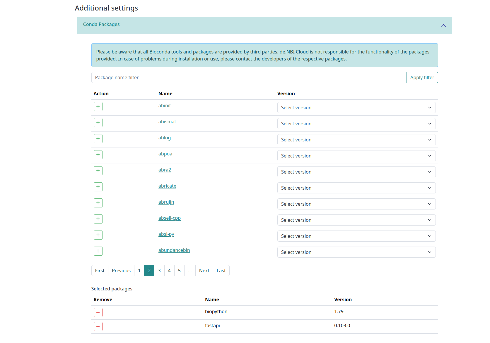

### Environment

You get a [Conda environment](https://docs.conda.io/projects/conda/en/latest/user-guide/concepts/environments.html) 
named 'denbi'.
You may find your selection of tools in this environment.
For your convenience, the installation process initializes the `.bashrc` for conda and creates an alias, 
so that you may load the 'denbi' environment by running the command in your vm:

~~~shell
denbi
~~~

## Research environments

You may find a selection of research environments here you may use over your web browser, e.g., 
[JupyterLab](#jupyterlab), [RStudio](#rstudio), [Apache Guacamole](#apache-guacamole) or [Theia IDE](#theiaide). 
In the future, you may find more research environments added.<br>

???+ info "Use with Anti-Virus Software"
    In some situations, anti-virus sofware may cause you to experience connection problems with browser-based research environments. 
    If you experience difficulties connecting, it is advisable to check whether your anti-virus software may be blocking the connection.
    

### Select a research environment

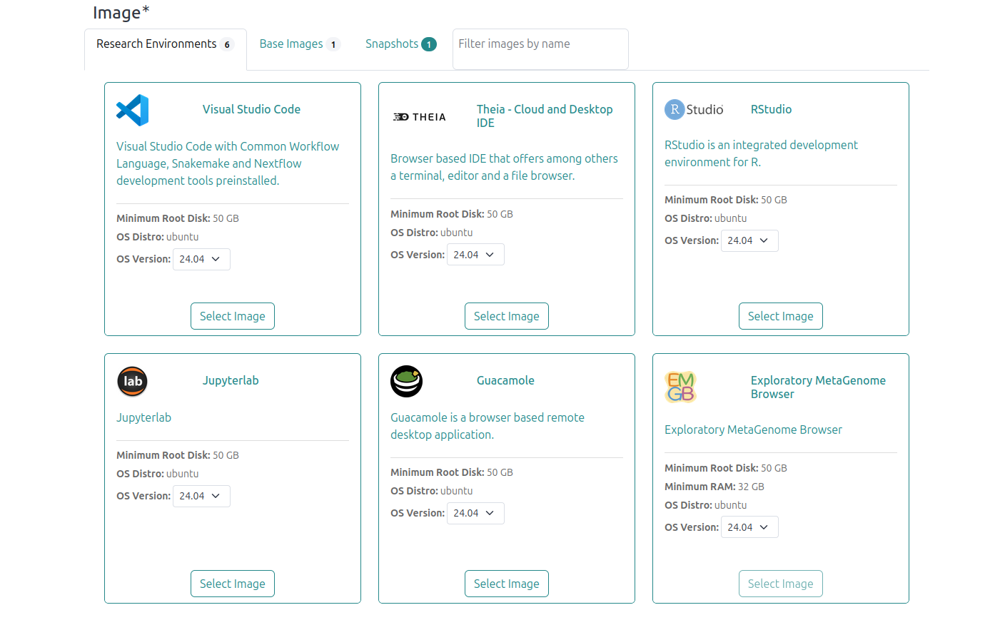

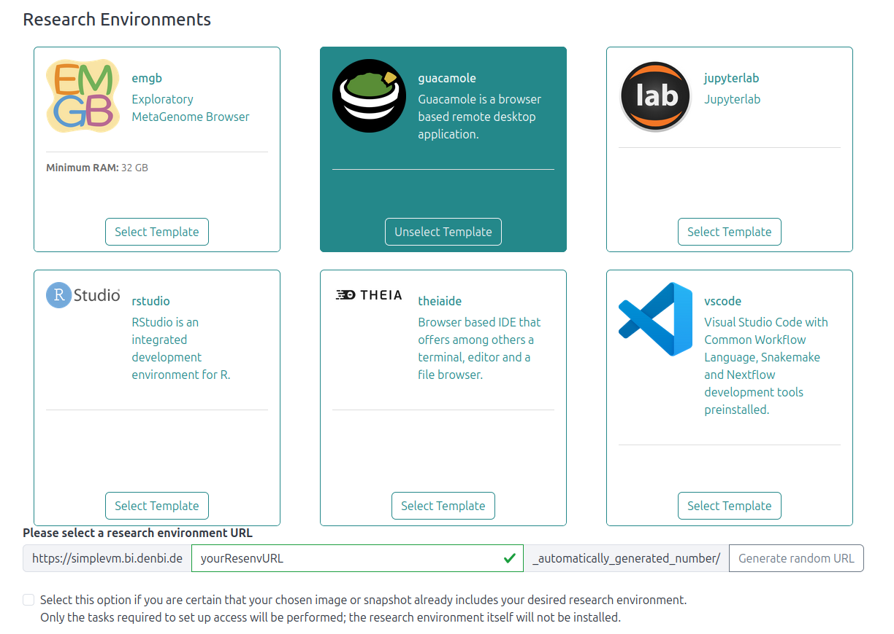

To start a research environment on your virtual machine, either select a pre-build image provided by de.NBI from the 
“Research Environment” tab or select a base image and a research environment template. 
By using a template, the research environment installs at vm launch.<br>
Either way, name your research environment or click to generate a random name. 
This name appears in the unique URL used to access your research environment.

???+ tip "Pre-build images versus base image with a template"
    Virtual machines with pre-build images start faster than base images with a selected template.


??? info "Installation process"
    Like the [installation process of Conda](#conda), we create a temporary rsa-keypair, which we use 
    to install your research environment with Ansible.
    Afterward, we remove the temporary key and copy your public key 
    onto your virtual machine, whether the process succeeds or fails.
    When the process finishes, you may download and look into the installation logs.

### Find your research environment URL

To access your research environment, follow the Link you find on the [instance overview](./Instance/instance_overview.md) 
or on the [detail page](./Instance/instance_detail.md) of your virtual machine.

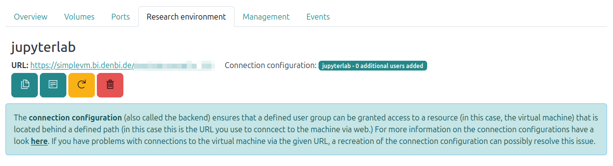

A LifeScience login prompt appears if you haven't already logged in with your LifeScience account.<br>
If you don't grant access to other members of your project on the detail page, 
only the person who started the vm may access the research environment.


#### On Connection configurations

The connection configuration (also called the backend) ensures that a defined user group can be granted access to a resource (in this case, the virtual machine) that is located behind a defined path. This configuration is stored in a dedicated service running in SimpleVM. These configurations serve as rules for accessing research environments that can be reached via the defined URLs. The connection is made on the basis of a reverse proxy using the OpenResty technology.
If users who are authorized to access the virtual machine in SimpleVM are unable to do so, it may be helpful to re-create the connection information. To do this, use the corresponding button below the information.

### JupyterLab

>[JupyterLab](https://jupyter.org/) is the latest web-based interactive development environment for notebooks, code, 
> and data. Its flexible interface allows users to configure and arrange workflows in data science, scientific 
> computing, computational journalism, and machine learning. A modular design invites extensions to expand and 
> enrich functionality.

To access your JupyterLab research environment, follow the link you find, after starting your virtual machine, 
in the instance overview or on the detail page of your virtual machine.
A LifeScience login prompt appears if you haven't already logged in with your LifeScience account.<br>
Afterward a prompt to log in to JupyterLab with a Token shows.

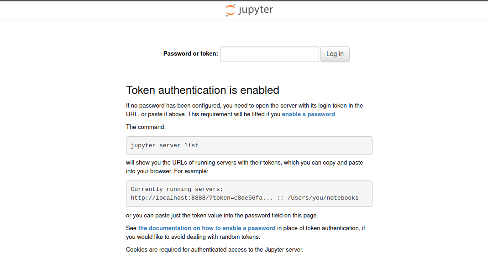

#### Login Token

Use the following Token:
```
simplevm
```

Now you can work with JupyterLab by web browser.

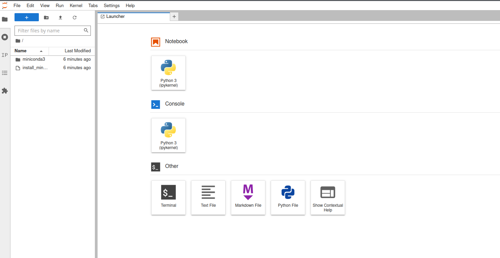

### RStudio

>[RStudio](https://rstudio.com/products/rstudio/) is an integrated development environment (IDE) for R. It includes a 
>console, syntax-highlighting editor that supports direct code execution, as well as tools for plotting, history, 
>debugging and workspace management.

To access your RStudio research environment, follow the link you find, after starting your virtual machine, 
in the instance overview or on the detail page of your virtual machine.
A LifeScience login prompt appears if you haven't already logged in with your LifeScience account.<br>
Afterward a prompt to log in to RStudio shows.

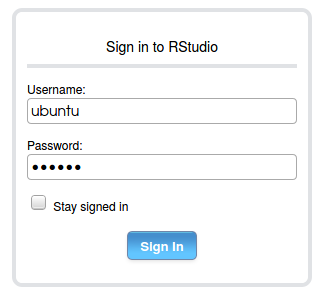

#### RStudio Package Manager
To enable a faster installation of RStudio packages directly via binaries, our RStudio images use the [RStudio Package Manager (rspm)](https://github.com/cran4linux/rspm).


#### Login credentials

Use the following credentials:
```
Username: ubuntu
Password: simplevm
```
If these credentials don't work, use the deprecated credentials (since 16.03.2020):
```
Username: ubuntu
Password: ogvkyf
```
Now you can work with RStudio by web browser.

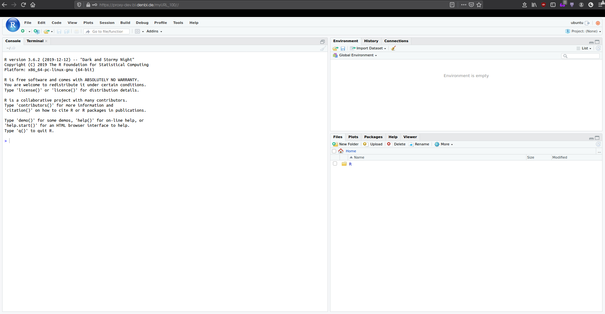

#### Multiple users and concurrent sessions

To grant other users access to your research environment, add them to the allowed list of users.
You may find the list on the [detailed page](./Instance/instance_detail.md#user-management).

???+ warning "Concurrent sessions"
    This doesn't automatically allow for concurrent sessions, i.e., your session terminates 
    once another user logs in with the same credentials.<br>
    For concurrent sessions, see this [guide](./rstudio.md).


### Apache Guacamole

> [Apache Guacamole](https://guacamole.apache.org/) is a clientless remote desktop gateway. It supports standard 
>protocols like VNC, RDP, and SSH. We call it clientless because no plugins or client software are required. Thanks to 
>HTML5, once Guacamole is installed on a server, all you need to access your desktops is a web browser.

???+ info "Rebooting a guacamole vm"
    After rebooting your vm or turning your vm from shutoff to active, 
    it takes about 15 minutes until you may access your Apache Guacamole research environment.

To access your Apache Guacamole research environment, follow the link you find, after starting your virtual machine, 
in the instance overview or on the detail page of your virtual machine.
A LifeScience login prompt appears if you haven't already logged in with your LifeScience account.<br>
Afterward a prompt to log in to Apache Guacamole shows.

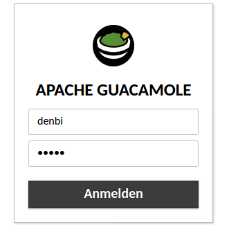

After logging in, choose a keyboard layout.

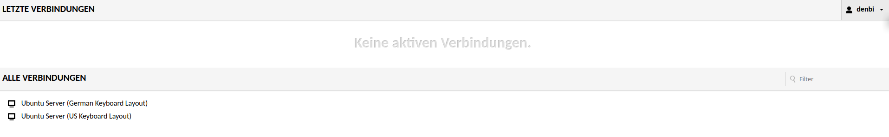

#### Known Issues

???+ info "Problems with connection after installation of updates"
    In case the shown dialogue is visible to you, restarting the virtual machine can fix the access to Guacamole.
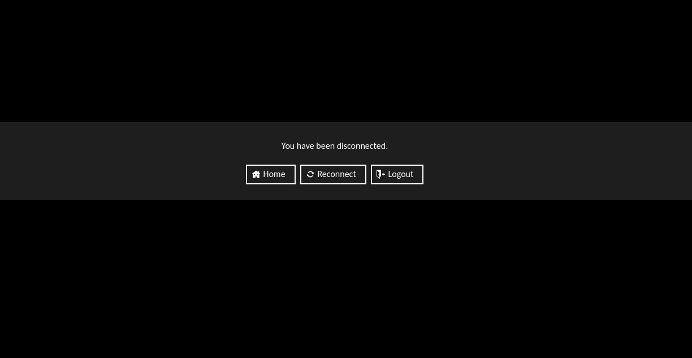

Automatic or manually triggered updates on the machines can cause problems with Guacamole. If you see a message like the one in the screenshot above, it means that the connection to the Guacamole service is not possible after updating packages and/or kernel versions of your VM's operating system.
Restarting the virtual machine, either via the graphical interface in SimpleVM or by sending a reboot command on the VM command line, will resolve the issue. Guacamole will be usable again as usual after restarting the VM.

#### Login credentials

Use the following credentials:
```
Username: denbi
Password: denbi
```

???+ info "Password prompt on inactivity"
    It may happen that, because of inactivity, a prompt for the password of the ubuntu user shows: 

    ```
    denbi
    ```

???+ warning "[DEPRECATED] Password prompt on inactivity"
    It may happen that, because of inactivity, a prompt for the password of the ubuntu user shows: 

    ```
    ogvkyf
    ```
Now you can work with Apache Guacamole by web browser.

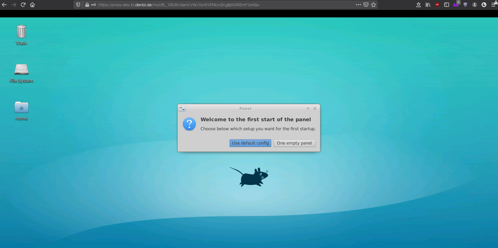

#### Multiple users and concurrent sessions

To grant other users access to your research environment, add them to the allowed list of users.
You may find the list on the [detailed page](./Instance/instance_detail.md#user-management).

???+ warning "Concurrent sessions"
    This doesn't automatically allow for concurrent sessions, i.e., your session terminates
    once another user logs in with the same credentials.<br>
    For concurrent sessions, see this [guide](./guacamole.md).

#### Copy-Paste related Browser Configuration

If you have issues copying and pasting content, e.g. from other browser tabs into graphical applications within Guacamole check your browser settings.
E.g. for Chromium based browsers make sure, that you have the correspondings permissions set.
In Firefox, you can allow the interactive copying by adjusting certain settings.
One needs to enter `about:config` in the URL-bar and enter the page. On entering one needs to accept the risk and can then type search bar to filter for specific settings. `dom.events.asyncClipboard.readText` and `dom.events.testing.asyncClipboard` need to be set to `true`. You may need to restart your browser after, so the changes are applied.

### TheiaIDE

> [Eclipse Theia](https://theia-ide.org/) is an extensible platform to develop full-fledged multi-language Cloud & 
>Desktop IDE-like products with state-of-the-art web technologies.

Find more information on TheiaIDE on the [tutorial page]({{extra.cloud_portal_wiki_link}}Tutorials/TheiaIde/).

To access your TheiaIDE research environment, follow the link you may find, after starting your virtual machine, 
in the instance overview or on the detail page of your virtual machine.
A LifeScience login prompt appears if you haven't already logged in with your LifeScience account.<br>
Now you can work with Theia IDE by web browser.

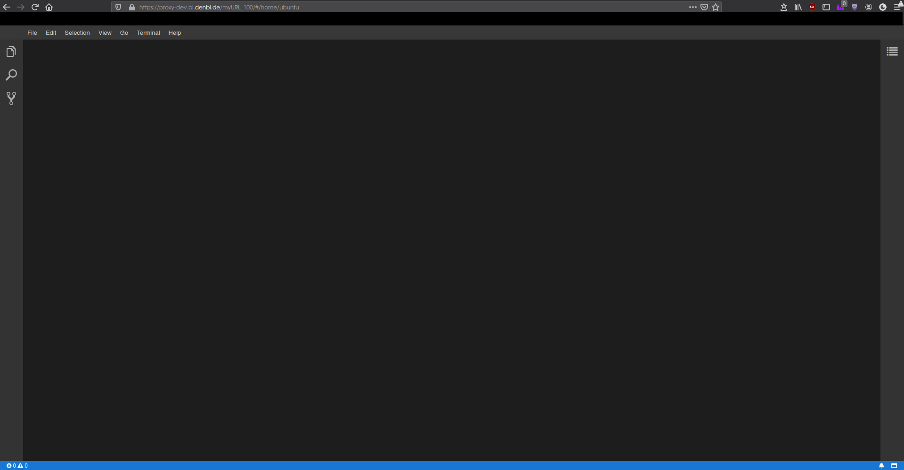

## Public Services (beta)

With SimpleVM Services, you may share a web application running on your virtual machine with other users.
This is useful if you want to make a tool, dashboard, documentation page, or other browser-based application available without requiring other users to log in to your virtual machine directly.

In contrast to predefined [Research environments](#research-environments), Services are not limited to a fixed set of applications.
Instead, they allow you to expose your own web-based application running on the virtual machine through SimpleVM.
Your web application must be available and listening on **Port 3838**.

### Share a service from your VM

To use Services, first start a virtual machine and deploy your web application on it.
Afterward, you may configure the service in SimpleVM and enable or disable authorization (see below) for it.
Once the service is available, other users may access it through the generated web link.

This makes it easier to share tools developed on a virtual machine, for example for demonstrations, collaboration, or internal project use.

### Access and authentication

Access to a shared service still requires authentication. Your research environment is by default only accessible by the owner and SimpleVM users which have to be selected manually.
If you disable authorization on your research environment, everyone with the link can access your research environment.
Users must still verify their identity before they can use the service, for example via Google or an institutional account (LifeScience).
This helps protect the underlying resources while still allowing services to be shared conveniently.

### Example applications

To help you test the Services feature yourself, we provide two example applications. You can deploy these two example services on a newly created instance. Choose the base image and the webservice research environment when creating the instance.

- [Jekyll example application](DUMMY_LINK_JEKYLL)
- [Shiny example application](DUMMY_LINK_SHINY)

Each repository contains a README file with instructions on how to deploy and test the example application.
