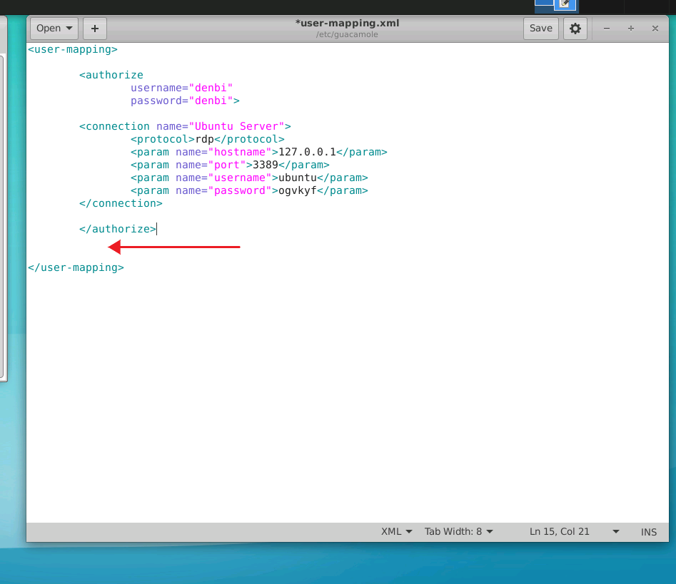

# Enable concurrent sessions for Guacamole 

By default, one concurrent session can log in per username.
To have more than one person logged in with different usernames, 
you need to add them first by following these steps. 

## Add user to research environment

If you haven't already done so, add the user to your research environment in the
[instance detail page](./Instance/instance_detail.md#user-management).

  

## Add new user to the machine

Access Guacamole as usual using your unique URL.<br>
Open a new terminal window:

  

### Create a new user

Add a new user:

```shell
sudo adduser USERNAME
```

Replace USERNAME with the name that you want to use.
The USERNAME must not yet exist on the machine.
Remember the password when asked, you need it later.
You can answer the other questions however you want or leave them blank.
This creates a new home directory for USERNAME.

### Grant root privileges (optional)

If you want to give the new user root privileges, use:

```shell
sudo usermod -aG sudo USERNAME
```

Replace USERNAME with the name of your created user.

### Install gedit (optional)

If you don't know how to use text editors like nano, vi, or vim, install gedit for easier usage. 
To install gedit, use:

```shell
sudo apt install gedit
```

### Add user to Apache Guacamole

Now add the new user to Guacamole. If you installed gedit, use it to open this file:

```shell
sudo gedit /etc/guacamole/user-mapping.xml
```

Otherwise, use the editor of your choice, e.g. vi:

```shell
sudo vi /etc/guacamole/user-mapping.xml
```

The file already has one user added, which is the user you logged in with.
You shouldn't remove that user.<br>
Add the following lines to the file (between the tags `<user-mapping>`, but after the tag `</authorize>`, 
see image):

  

```xml
        <authorize
                username="USERNAME-FOR-WEB-LOGIN"
                password="PASSWORD-FOR-WEB-LOGIN">

        <connection name="Ubuntu Server">
                <protocol>rdp</protocol>
                <param name="hostname">127.0.0.1</param>
                <param name="port">3389</param>
                <param name="username">USERNAME-YOU-CREATED</param>
                <param name="password">PASSWORD-YOU-CREATED</param>
        </connection>

        </authorize>
```

Here you need to fill the following four variables.  
`USERNAME-FOR-WEB-LOGIN` and `PASSWORD-FOR-WEB-LOGIN`: the credentials the user will log in with when 
using the web browser. They can be the same as the credentials you used when creating the user.<br>
`USERNAME-YOU-CREATED` and `PASSWORD-YOU-CREATED`: the username and password you chose when creating the new user.  

Save and close the file (use ++ctrl+s++ to save if you used gedit).

###  Log in

Now another user can log in with the credentials `USERNAME-FOR-WEB-LOGIN` and `PASSWORD-FOR-WEB-LOGIN` to start a 
concurrent session.
You need to repeat this process for every user who wants to run a concurrent Guacamole session on this virtual 
machine.
