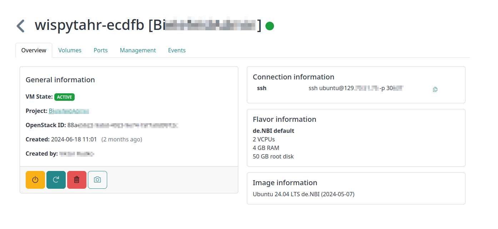
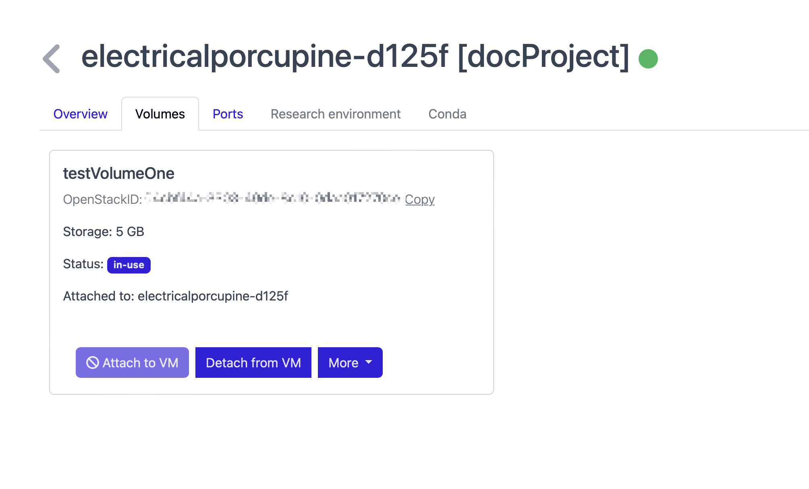
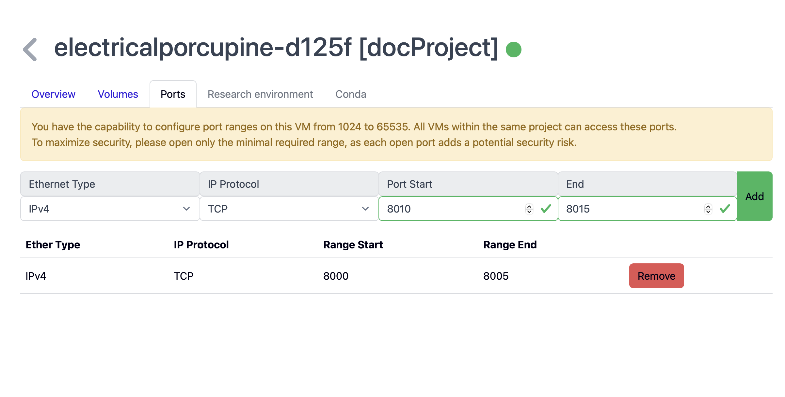
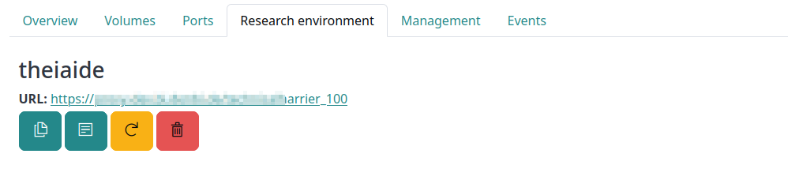
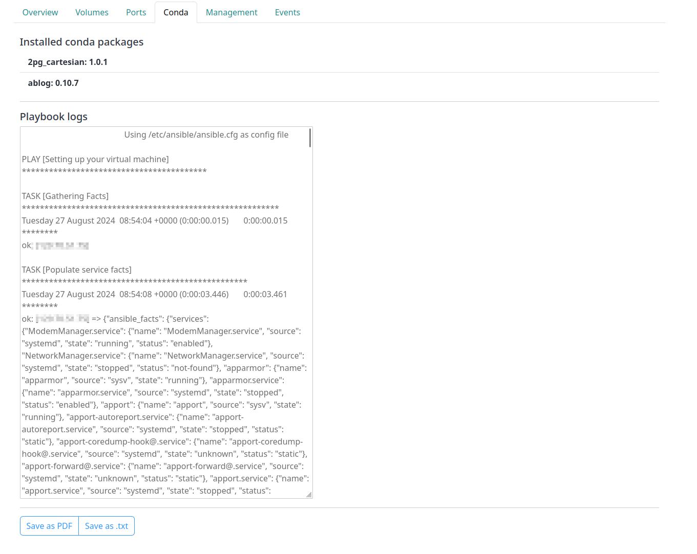

# Instance detail

The detail page offers more information about a virtual machine and extra actions.

## General Overview

The overview of the instance detail page shows the most important information of the machine.
This section is devided into several parts

### General Information
This part shows:
 - The state of the VM, i.e. whether it is active or shut down, for example.
 - The project the VM is running in - you are also able to access the corresponding project overview clicking on the name of the project.
 - OpenStack-ID: the ID of the machine in the corresponding compute center. In case you have any problems with your machine, this identifier is very helpful for the support, when contacted
 - Creation date and user who created the machine
 
 It also enables the user to perform certain actions with the machine:

  - **Stop VM** 
      Shuts off the virtual machine. You may resume it afterward, but you can't access it while in "SHUTOFF" state.
  - **Reboot VM** 
      [Soft or hard](https://docs.openstack.org/mitaka/user-guide/cli_reboot_an_instance.html) reboot your virtual 
      machine.
  - **Create Snapshot** 
      Take a snapshot of the virtual machine. 
      See [here](snapshots.md) for more information.
  - **Delete VM**  
      Delete the virtual machine. Any attached volume gets detached but not deleted.
  - **Resume/Restart VM**  
      Boot up the "SHUTOFF" virtual machine.

### Connection information

The connection information shows how to connect to the machine via **ssh** and in case a research environment is installed on the machine, the URL for browser access is shown.

### Flavor information

Shows information about the resources assigned to the virtual machine, like the number of VCPUs and the amount RAM.

### Image information

Shows the image the VM runs on. 

## Volumes

This tab shows which volumes are attached to the machine and allows actions like detaching, renaming or deleting the volume.
For each volume, the unique OpenStack ID, the storage capacity, and the status is shown. 
For more information on volumes, see the [volume](./volumes.md) wiki page.

## Ports

When enabled for the project your machine is running in, you are able to configure port ranges for the vm, so it allows connections on these ports when sending requests from machines in the same network. In the case of SimpleVM, all machines in a project are located in the same network. Machines outside this network cannot access these ports. 
You can open port ranges from port 1024 to 65535.
The Ethernet type, the IP protocol and the start and end of the range can be specified for each range. This setting can be added to a machine with **Add**. Released port ranges can be removed again in the list below with **Remove**. 

???+ warning "Safety-critical"
    As this is potentially a safety-critical feature, these authorisations should be used with caution.

## Research environment

This tab delivers information about the installed browser-based research environment.
For more information on Research Environments, see the [customization](./customization.md#research-environments) wiki page.
This includes the chosen environment itself and the URL to access it via browser.
You are able to copy the link, view the logs of the research environment setup and to renew the backend or delete it.
Deleting the backend of the research environment will make the research environment unaccessible.
When problems with the access occur, a renewal of the backend might fix the problem.

The user management enables you to grant and revoke access to the research environment. 
To grant access, a user has to be a member of the project.

???+ warning "Concurrent sessions"
    This doesn't automatically enable concurrent sessions, i.e., your session terminates
    once another user logs in with the same credentials.
    For information on concurrent sessions, see the specific 
    section of the [research environment](customization.md#research-environments).

## Conda

The conda tab shows which conda packages got installed on the machines during startup.
Below a log of the installation can be viewed and downloaded as a `PDF` or `.txt`-file