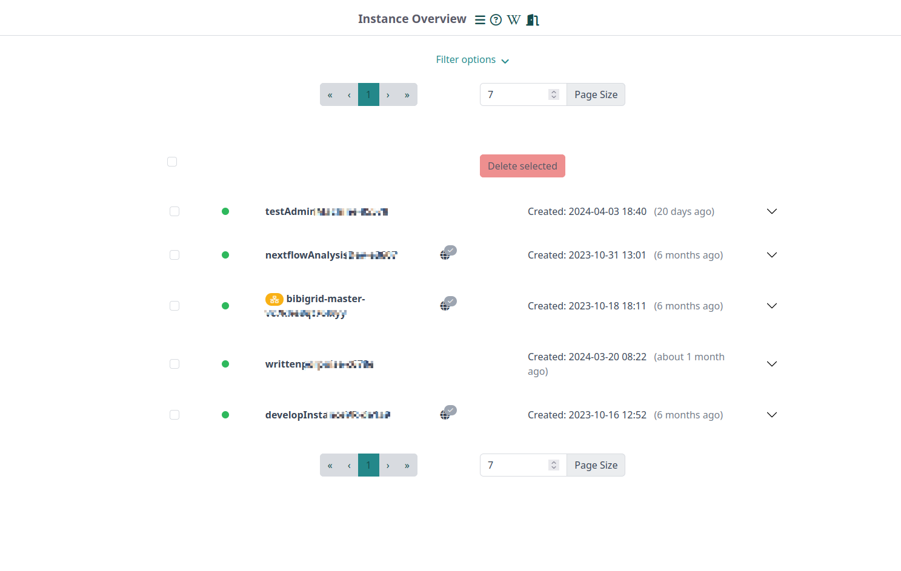
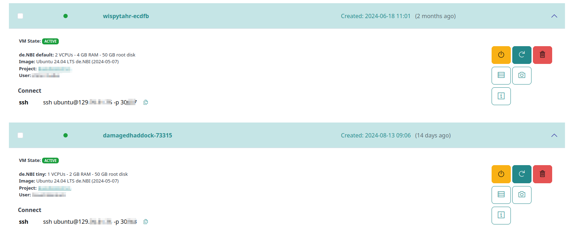

# Instance overview

On the “Instance Overview” you can list virtual machines, get more information, and manage them.

## Layout

The layout of the instance overview serves several functions.

#### Pagination

The pagination allows you to adjust how many VMs you want to see on a page and scroll through the pages.

#### Filter

You are able to filter the shown VMs as follows:

- A string search, which filters machines by name, the name of the project it is part of, the OpenStack ID of the machine or the username.
- Machine state, e.g. only showing active machines
- When having the corresponding permissions, you can also filter by permission type: See your own machines, or also the ones you are allowed to so within your project.

The list of machines is adjusted by clicking on "Apply".

#### Deletion of selected machines

Either all or specific machines can be selected by clicking on the checkbox in front of the machine state-indicator and name.
All selected machines can then be deleted by clicking on "Delete Selected".

#### Base Information

Each machines is represented by a seperate clickable component.
The header of the component shows the following information on first glance:

- **Machine status**
- **Machine name**
- **Descriptive Icons**
   The icons allow you to get a quick overview of further machine configurations:  

  - See the amount of volumes mounted to the vm.
  - See the installed research environment and whether it installed correctly. Clicking the icon copies the URL of your browser-based research environment into your clipboard.
 - See the amount of conda tools installed on the virtual machine at launch and whether the installation was successful.

- **Creation date**

#### Further Details and actions

  

By clicking on the header of a specific machine listed, a more detailed description of the machine is shown.
This includes the following information:
- **Flavor and Image**
- **Project**
- **User in charge of the machine**
- **Connection information for SSH and link to Research Environment access, if available**

This detailed area also includes action buttons, which allow you to quickly control the instance via the overview.
For example, the VM can be stopped or restarted. Snapshots can be created and the machine can be deleted. 
All actions are asked to be confirmed.

The overview also has buttons that lead to the details page of the instance. This is divided into different areas, which can be accessed directly using the buttons. This includes a summary of the machine, volume management, port settings, information and settings for the research environment, user management and an event log.

