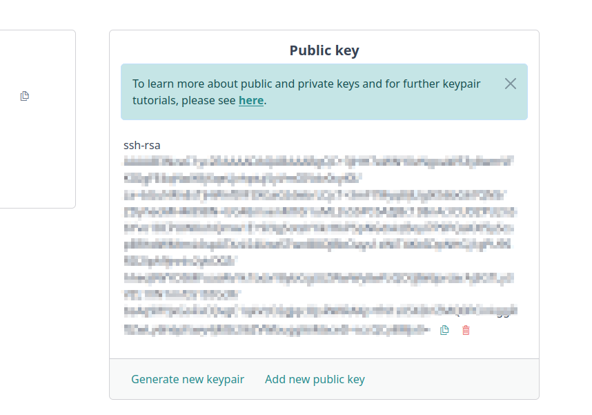
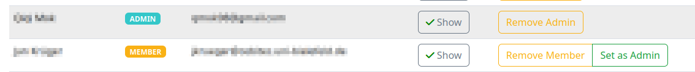

# SSH keys and how to share access

You need a valid SSH keypair to access virtual machines.

## Basics on SSH keys

A keypair consists of a public key and a private key. A public key encrypts data, and a private key decrypts data.
You should usually not share a private key because someone else can decrypt the data you encrypt.<br>
You can imagine a public key encryption as a padlock, which you close once you encrypt data with it. 
A private key would be the key, which unlocks the padlock. 
If you place a public key on a virtual machine, the virtual machine sends you the data encrypted by the public key. 
One needs the private key to decrypt the data the virtual machine sends.<br>
This happens automatically when using a secure shell or SSH for short. 
The virtual machine encrypts the data with the public key placed on it, and it gets decrypted with the private key 
you use to establish an SSH connection, e.g., by using

```shell
ssh ubuntu@<IP> -i /path/to/your/private/key -p <PORT>
```

This means the following things:

1. When you use a private key, which doesn't correspond to a public key placed on your virtual machine, you can't
   decrypt the data and can't access **any** data on the virtual machine.<br>
   You may get a note that reads, for example, `Permission denied (publickey)`. Then you used the wrong private key.<br>
   Only a private key corresponding to the public key on the machine can decrypt the data.

2. Only someone with access to the machine can change the public keys, which the virtual machine recognizes and uses.<br>
   **The staff of the de.NBI Cloud** doesn't belong to the people, who can access your virtual machine and change 
   its public keys.
   Your virtual machine, once active, only recognizes the public key you have set on your profile page 
   when you started the virtual machine.
   This excludes some special options, like starting virtual machines for a workshop, 
   or granting access to selected project members when starting your vm.<br>
   Therefore, once you started your virtual machine, **no one but the people you granted access** can change the 
   public keys on your virtual machine.

???+ warning "On key pair security"
    *Every* padlock design has an opening mechanism. 
    Therefore, no padlock in existence can guarantee you 100% security, 
    good padlocks can only guarantee you sufficiently good enough security. 
    This applies to key pairs too. Modern key pairs, like the ones you can create on the profile page, guarantee 
    you good enough security with the state of the current collective knowledge. 
    They **don't** and **can't** guarantee you good enough security for every future to come.

You have to set a public key on your profile page when you want to start a virtual machine. 
After launching a vm, only the private key corresponding to the public key set on your profile page when 
you initially started the virtual machine can access it and decrypt the data the vm sends you.<br>
**You lose the private key, you lose access.**

### Permissions

When trying to connect to your machine via SSH, you might encounter the following error message:

```shell
@@@@@@@@@@@@@@@@@@@@@@@@@@@@@@@@@@@@@@@@@@@@@@@@@@@@@@@@@@@
@         WARNING: UNPROTECTED PRIVATE KEY FILE!          @
@@@@@@@@@@@@@@@@@@@@@@@@@@@@@@@@@@@@@@@@@@@@@@@@@@@@@@@@@@@
Permissions 0777 for '<KEYFILE_NAME>' are too open.
It is required that your private key files are NOT accessible by others.
This private key will be ignored.
Load key "<KEYFILE_NAME>": bad permissions
ubuntu@123.45.67.89: Permission denied (publickey).
```
You can then enter the following command to adjust the key file permissions.
```shell
sudo chmod 600 /PATH/TO/MY/PRIVATE/KEY.pem
### e.g ./my_private_key.pem
```
You should be able to connect to your machine with the known SSH-command afterwards.

## Key handling on profile page

For starting of virtual machines you need to have at least one valid public key set on your user profile page.
The public key area has the following functionalities:

   1. View your currently set public keys
   2. Remove public keys connected to your profile
   3. Add a new public key, generated on your own
   4. Generation of a new keypair, with the public part automatically being added to your list of keys

All keys listed on your profile page will be added to machines which are started by you or to which project members have
shared access to you on startup. 

### Removal of keys

???+ info "Migration of keys from Cloud Portal"
    If there is a key set in the Cloud Portal, it will be migrated to SimpleVM automatically
    Removing it from your list of keys on the profile page in SimpleVM will have no effect.
    Migrated keys need to be removed from on the Cloud Portal, profile page.
    Find more information about SSH keys on the profile page [here]({{extra.cloud_portal_wiki_link}}portal/user_information/#ssh-key).

For the removal of a key just click on the trash-can icon next to the key you want to remove from your 
connected private keys.
**Please consider: When starting new machines, you will not be able to connect to any of these machines with the corresponding private key connected to the removed public key.**
Already started machines are not affected.


### Adding of public keys

An instruction on how to generate SSH-Keypairs by yourself can be found [here]({{extra.cloud_portal_wiki_link}}quickstart/#generate-ssh-keys).
The generation will result in two parts of the keypair - the public and the private key.
Click on "Add new public key" and copy the content of the public key into the input field.
The key is checked and when the validity is confirmed, a click on "Set" will add the key to the list of public keys
associated with your account.


### Generation of keypairs

When clicking on "Generate new keypair" information on the keys and key permissions is shown.
Confirm that you are aware of the stated effects and click on "Set" to generate a new keypair.
Now automatically a new ecdsa-keypair is generated and the public key is directly added to your public key list.
The download of the private key is initiated in your browser. You may still need to confirm the download.
Please keep the private key as long as you want to access machines with this key.



???+ info "For Windows users: Using PuTTY generated keys"
    You can use existing .ppk key pairs generated by [PuTTYgen](https://www.puttygen.com/) to connect to your SimpleVM instance. Please refer to this [tutorial]({{extra.cloud_portal_wiki_link}}quickstart/#generate-ssh-keys).<br>
    In addition, **the private key should be exported in OpenSSH format** by performing the following steps:
        
    1. Open PuTTYgen
    2. Click File -> Load private key
    3. Go to Conversions -> Export OpenSSH and export your private key

If you want to know more about the technical details of key pairs, 
start with the [wikipedia](https://en.wikipedia.org/wiki/Public-key_cryptography) page on keys and cryptography.

## Share access

You need a valid public key from the person you want to share access with.

???+ info "Where to find public keys of your project members"
    If set, you can find the public key of another project member by using the member list on the project overview.
    Click the button to see their public key.
    

If they don't have an SSH key pair yet, they need to generate it. 
They can use ssh-keygen, or they can [generate a public key](../portal/user_information.md#ssh-key) on 
their profile page.<br>
Add the key to your virtual machine after getting their public key.

On a Linux distribution, you can do it with the following command:

```shell
ssh-copy-id -i /PATH/TO/THE/OTHERS/PUBLIC/KEY -p PORT_OF_YOUR_VM -o "IdentityFile /PATH/TO/YOUR/PRIVATE/KEY" ubuntu@USUAL_IP_ADDRESS
```

You can find the port and ip address on the virtual machine overview, or the detail page of your vm.
<br>
Otherwise, use the following steps to add a user to a virtual machine:

1. Connect to your machine as usual.
2. Use the command:<br>
```shell
nano .ssh/authorized_keys
```
   This opens the file that stores all the public keys that grant access to your virtual machine. 
   Your key is already in that file, don't change it.
3. Copy the **public key** of the other person and add it in a new line after the other lines.<br>
   Use ++ctrl+x++ to close the file.<br>
   Confirm when it asks whether you want to save your changes.

Now the other user can access your virtual machine. 
If you experience any troubles, contact the helpdesk at [cloud-helpdesk@denbi.de](mailto:cloud-helpdesk@denbi.de).

???+ info "Reminder on responsibility"
    Only add the ssh key of people you trust.<br>
    You have the responsibility for your virtual machine and all actions on it, 
    even if you share access with other people.
