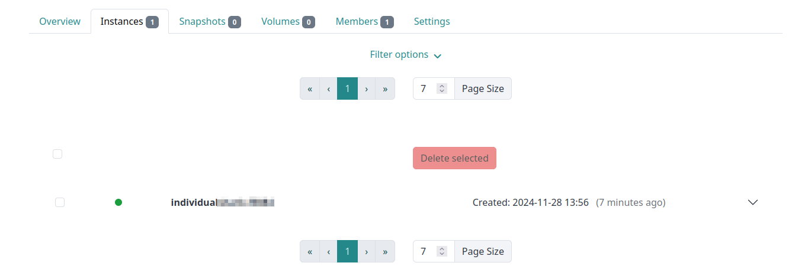

# Project Management

The resources available for use, group memberships and permissions are organized with projects within SimpleVM. The single projects one is a member in can be seen in the sidebar. In case if you have a high number of project memberships, it might be, that the single projects are hidden in the menu-dropdown "Your Projects".
Regarding group and project permissions please have a look [here](./permissions.md).

## Project Overview

When clicking on a certain project, the project overview gets shown.

It shows an overview of the resources available for the project and holds links to the most important features as starting of machines and creating volumes specifically for the project shown.
Under "Open Registration" project administators are able to create an invitation link, that can be used to add more users to the project.

## Instances

When clicking on instances, the tab which holds an overview similar to the [general instance overview](./Instance/instance_overview.md) will be shown.
It lists all machines one is allowed to see and which are part of the corresponding project.

## Snapshots

The snapshot tab is also similar to the [general snapshot overview](./snapshots.md), but the snapshots visible are limited to the corresponding project.

## Volumes

Also the volume-tab shows a list of all volumes belonging to the current project and allows to manage to the corresponding volumes. Unlike the [general volume overview](./volumes.md) one is not able to create new volumes in this tab.

## Workshops

If the workshop functionality is enabled for the project, one can see an overview of the existing workshops for the project and access the corresponding [workshop management](./workshop.md).

## Members

In this tab one is able to see the members of the project and manage them if the corresponding rights are given for the account.
E.g. as an project administrator one is able to remove other members or promote them to project administrators.

## Settings

In the project settings as an project administrator one is able to adjust the visibility of the member-listing for non-administrators. The same holds for changing the permissions regarding the start of machines, which can be activated or deactivated for non-administrators within the project.
Also one can allow or disallow non-administrators to open [ports](./Instance/instance_detail.md#ports) for machines within the project. 
If the project is a workshop project one can allow members of the projects, that are non-administrators to view workshops without being set as a tutor for the specific workshops.

