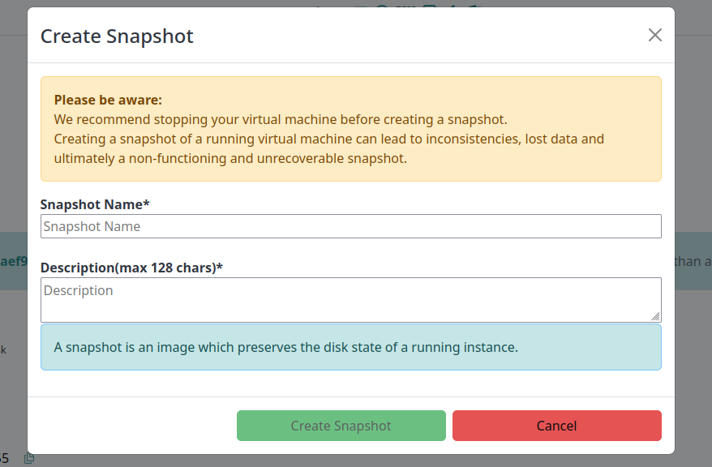
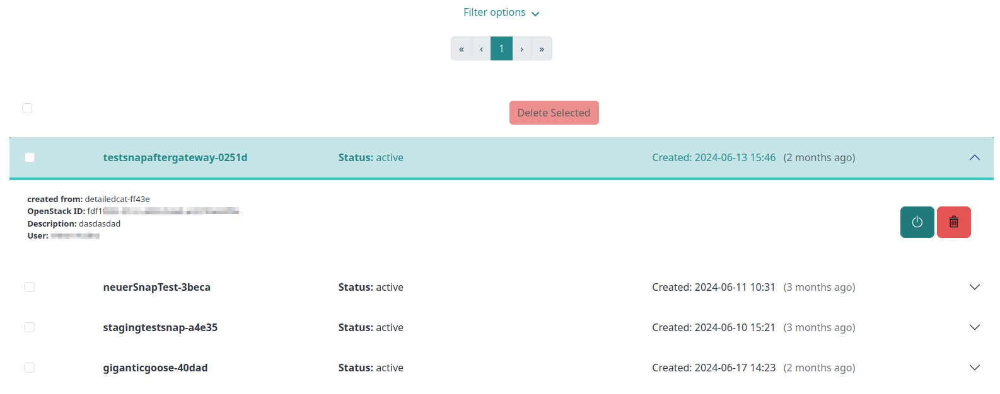
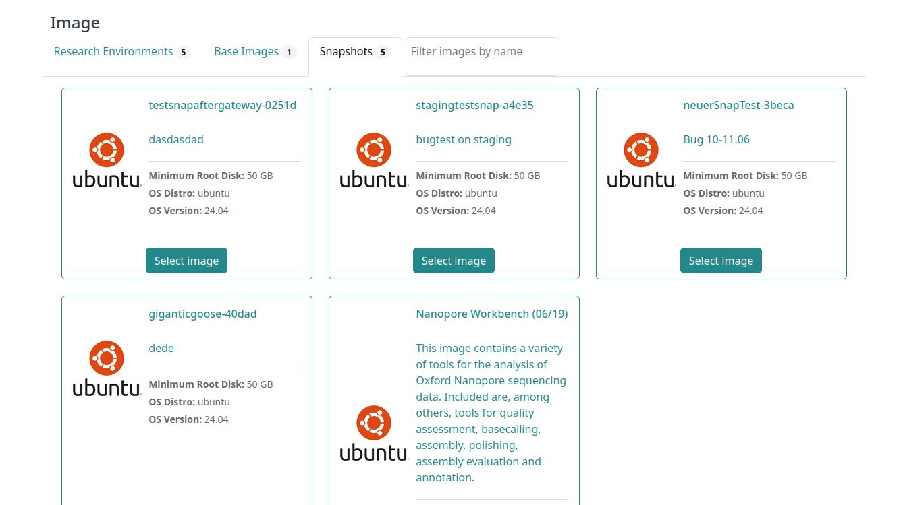

# Images and snapshots

You use an image, or a snapshot, to boot your virtual machine.

## Image

Images contain a bootable operating system, for example, a Linux derivative as Ubuntu or CentOS.
They can have further collections of tools, packages, and configurations, for example RStudio or Apache Guacamole. 
While each cloud site provides a selection of images you can use to boot up a virtual machine,
de.NBI provides the same selection of images for every cloud site.

## Snapshot

A snapshot is an exact copy of your virtual machines hard disk storage.
You use the snapshot of an instance as the basis for another instance. 
A typical workflow can be:

- To create a virtual machine based on a de.NBI provided image, to configure
  the virtual machine with needed tools and packages, and to create a snapshot from that configuration.
  Afterward, you launch new virtual machines based on the snapshot, so that you don't need to configure
  it every time.
- To configure a virtual machine for a workshop, create a snapshot of that machine, and afterward, launch a virtual 
  machine for every user based on that snapshot.
- Save your configuration and data on your root disk to continue your work later.

???+ info "Snapshot limitation"
    A snapshot preserves the full state of RAM. Therefore, you can only snapshot a virtual machine with up to a 
    maximum of 256 GB RAM. Please also consider our information on snapshots of running instances!

### Create a snapshot

After starting a machine you can go to the [instance overview](./Instance/instance_overview.md#further-details-and-action) tab 
and create a snapshot, or you create one on the [detail page](./Instance/instance_detail.md#general-information).
A window opens where you can enter a name for your snapshot. Confirm to create a snapshot.

???+ danger "Don't create a snapshot of a running instance"
    Creating a snapshot of a running instance can lead to inconsistencies, lost data and a non-functioning and
    unrecoverable snapshot. 
    Stop your instance before creating a snapshot.

### View snapshots

  

On the snapshot overview page one can filter all snapshots one is allowed to view and to either start a new instance with them or delete the snapshot. The information delivered for a certain snapshot includes:
 - the snapshot name
 - the snapshot status
 - the creation date (if the snapshot creation is finished)
 - the name of the machine the snapshot originated from
 - the OpenStack ID of the snapshot
 - the description entered on creation

### Boot from a snapshot

After you successfully created the snapshot, you can go to the [new instance](./Instance/create_instance.md#5-image-selection) 
tab and choose your created snapshot as an image to start a VM.
If one clicks on the creation button, the correspondig project a snapshot is associated with, and the snapshot is preselected on the [instance creation page](./Instance/create_instance.md).

The snapshot selection is also always when entering the instance creation over the navigation.

