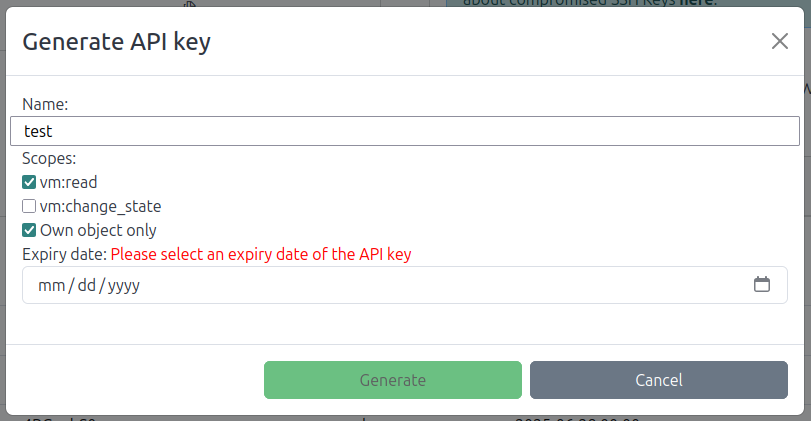

# User API Keys

???+ info "Beta feature"
    This feature is only available for superusers for now.

Using API keys, you can access SimpleVM features through your terminal or programmatically. The API key is another way to authenticate as your account, so that you can perform actions without having to login in the SimpleVM webapp.

## Generating API Keys



You can generate an API key using the corresponding action at the bottom of the API keys view on your profile page.

You will be asked to select one or more scopes, select at least one scope to create an API key. The generated API key will only have access to the actions regarding the selected scopes, e.g. you can list your machines with a key with vm:read scope, but you cannot start any new machine with it.

The Own Objects Only option is set on default. Deselecting it means that you will be able to access everything within your permissions, including virtual machines or volumes created by other users. Only deselect this option when you are sure that you won't affect important data with your key.

The generated key is displayed at the top of the API keys table. Since it contains authentication information, we will not store the key in the database. Please save the key somewhere safe and handle it with care. Should you fear that an API key is leaked or otherways compromised, simply delete it from the table.

## Using API Keys

After generation, you can use the API key to access the SimpleVM API. Here are some examples:

**Creating a VM in a Project**<br>
```shell
curl -X POST http://simplevm.denbi.de/api/vms/ -d 'project_id=YOUR_PROJECT_ID' -d 'image_name=YOUR_IMAGE_NAME' -d 'flavor_name=YOUR_FLAVOR_NAME' -d 'vm_name=YOUR_VM_NAME' -H "X-API-KEY: YOUR_API_KEY"
```
<br>

**Stopping a VM**<br>
```shell
curl -X POST http://simplevm.denbi.de/api/vms/YOUR_VM_OPENSTACK_ID/action/ -d 'os_action=stop' -H "X-API-KEY: YOUR_API_KEY"
```
<br>

**Resuming a VM**<br>
```shell
curl -X POST http://simplevm.denbi.de/api/vms/YOUR_VM_OPENSTACK_ID/action/ -d 'os_action=resume' -H "X-API-KEY: YOUR_API_KEY"
```
<br>

For more API endpoints, please refer to [this page](http://simplevm.denbi.de/portal/api/docs/).
