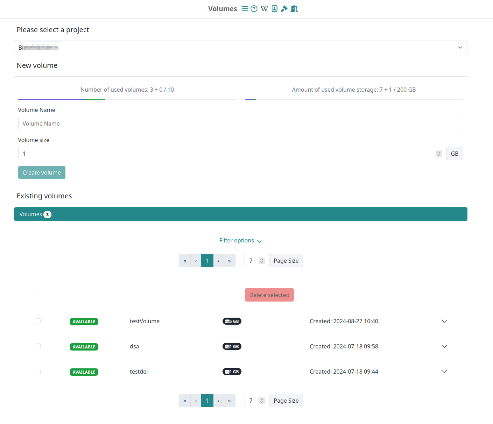
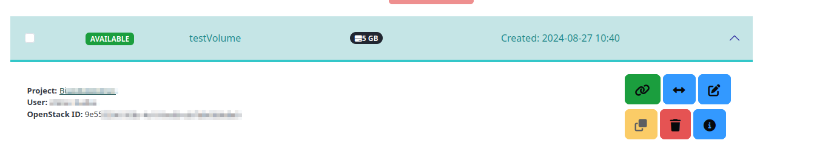

# Volumes

Volumes offer extra disk space for your virtual machine.
You can create new volumes on the volume overview page or when starting a new virtual machine. 
You can attach and detach volumes both on in the volume overview or on the [instance overview](./Instance/instance_overview.md) and also on [detail pages](./Instance/instance_detail.md  ) of single VMs.

## Layout

### Selection and resource overview



The volume overview splits the shown volumes into certain projects. So if one user has multiple projects that the user is a member of, a corresponding project has to be selected. 
For this specific project the volume usage information is shown below the project selection. It covers both the number of available and used volume instances, as well as the amount of used and available storage.


### Creation of new Volume

If the resource usage of the project still allows the creation of new volumes, one is able to create a new volume by entering a name and a volume size. After successful creation, the volume is listed below.

To use the new volume, you need to create a filesystem and mount it. See [mount a volume](#mount-a-volume).

### Listing of existing volumes

The volumes that are connected to a specific project can be listed and managed. The list can be filtered by volume statues, ownership and by a simple text filter, which allows to enter a specific name, user or OpenStack-ID. The list that is delivered is paginated.



Each entry in the listing is a collapsible entry. The header of the entry shows the status of the volume, its name and storage size and the creation date.

If one opens a single entry, the project name, the owner and the OpenStack-ID of a volume is shown. Also on the right side of the collapsible area the action buttons for a certain volume are shown.

#### Volume actions

One can: 

- **Attach a volume**:
  Attach an available volume to an existing virtual machine.
- **Detach a volume**:
  Detach an in-use volume from an existing virtual machine.
- **Extend volume** 
  Extend the size of the volume if your project has enough resources left. You usually have to configure the volume on the virtual machine after extending it. For more information, see [Extend a volume](#extend-a-volume).
- **Rename a volume**: The name of a volume can be changed.
- **Clone a volume**: A copy of a volume can be created
- **Delete a volume**: One can delete a volume after confirmation
- **Show the volume event log**: Show a list of logged events, like attachments and detachments for a certain volume.

!!! info "Attaching and detaching"
    You can attach and detach volumes only to and from an active virtual machine.


### Create the volume file system

???+ warning "Do that only once"
    Read carefully. Do this step only once after you created your volume by using the creation function and attached it to a corresponding machine.
    dialog. Repeating this step can destroy all the data on your volume.

To place files onto your new volume, there needs to be a file system on it.
To generate a file system, you need to "format the device".<br>
First, use this command to list all the block devices connected to your VM:

```shell
lsblk -o NAME,SIZE,MOUNTPOINT,FSTYPE,TYPE | egrep -v "^loop"
```

You get a list like this:

| NAME    |  SIZE | MOUNTPOINT | FSTYPE | TYPE |
|:--------|------:|:-----------|:-------|:----:|
| vda     |   50G |            |        | disk |
| └─vda1  | 49.9G | /          | ext4   | part |
| └─vda14 |    4M |            |        | part |
| └─vda15 |  106M | /boot/efi  | vfat   | part |
| vdb     |   50G | /mnt       | ext4   | disk |
| vdc     |    1G | [SWAP]     | swap   | disk |
| vdd     |  300G | /vol/data  | ext4   | disk |
| vde     |  500G |            |        | disk |

You get shown the name, the size, the mountpoint, and the file system type from all connected block devices.

???+ tip "What do the columns tell?"
    The column `NAME` tells you the name of the block device. When you perform an action on it, you typically
    prepend `/dev`. For example, to unmount the volume vdd, you use `sudo umount /dev/vdd`.
    Parts of one disk have a number at the end. See the column `TYPE`.<br>
    The column `SIZE` tells you the size of the block device in human-readable format `M`, `G`, `T`, and so on.<br>
    The column `MOUNTPOINT` tells you where you find the data from that block device. When empty, you need to
    mount the device.<br>
    The column `FSTYPE` tells you the file system type of the block device. Many file system types exist.
    If you want to use a block device, but the fstype is empty, you need to format it.

???+ info "What devices does the output show?"
    One block device, usually vda, is your root disk. It has your operating system and all relevant files. 
    You can identify it by its mountpoint `/`. You must not alter the block device containing your root disk,
    you may damage your virtual machine irreversibly.
    Only alter it if you know what you do.<br>
    One block device, identified by fstype `swap`, is your swap disk or swap file.<br>
    One block device can show up at the mountpoint `/mnt`. This is typically the ephemeral disk, which shows only
    when you start a flavor with an ephemeral.<br>
    You can identify the volumes created, attached, and mounted when creating a vm, by comparing the size
    and mountpoint of the block device. Further, it shows the fstype `ext4`.

The volume you look for has an empty `FSTYPE`, an empty `MOUNTPOINT` and the `SIZE` should compare to the size of 
the volume you created and attached. The size can differ a bit because of differences in Bit and Byte.<br>
In the table from the example output, the device you look for would be vde.

!!! Danger "Formatting a device `DESTROYS ALL DATA` on it!"
    You must format new data disks, for example volumes, **only once** to use them.<br>
    **NEVER** apply this command to an **ALREADY FORMATTED DISK** if you value the data on that disk.<br>
    See if a volume has a file system type by using the `lsblk` command.

Format the volume with a filesystem, e.g. `ext4` or `xfs`:

```shell
sudo mkfs.ext4 /dev/vdx
```

## Mount a volume

When you mount a volume, you make its data available under a path.
You can call this path a mountpoint or mount path.<br>
Create a mountpoint with:

```shell
sudo mkdir -p /vol/RENAME_ME
```

Change `RENAME_ME` to a path where you want your volume data accessible, for example to `/vol/data`.

To get an overview of all connected devices and get the `device_name`, use:

```shell
lsblk -o NAME,SIZE,MOUNTPOINT,FSTYPE,TYPE | egrep -v "^loop"
```

Mount the volume under the created directory with:

```shell
sudo mount /dev/device_name /vol/RENAME_ME
```

Change the owner of the volume data with:

```shell
sudo chown -R ubuntu:ubuntu /vol/RENAME_ME
```

Use again the lsblk command to verify the changed mountpoint.

```shell
lsblk -o NAME,SIZE,MOUNTPOINT,FSTYPE,TYPE | egrep -v "^loop"
```

If you don't need the volume you can unmount it with:

```shell
sudo umount /dev/device_name
```

### After a vm restart

When you reboot your vm, or stop and resume it, you might need to mount your volumes again.<br>
You can change the `/etc/fstab` file to automatically mount volumes at startup.
Get the devices connected to your vm with:

```shell
lsblk -o NAME,SIZE,MOUNTPOINT,FSTYPE,TYPE,UUID | egrep -v "^loop"
```

A device doesn't get attached under the same name every time, therefore, use the UUID of a device.
Open `fstab` with:

```shell
sudo nano /etc/fstab
```

Add a line like:

Here is the revised example:

```shell
UUID=uuid_of_your_volume /vol/RENAME_ME auto defaults,nofail 0 2
```

The `nofail` option prevents boot failure if the volume cannot be mounted.
Save and exit with ++ctrl+x++ and confirm when asked whether you want to save.
To mount the volume run:

```shell
sudo mount -a
```

That command mounts every volume in the fstab file.
Your volume gets mounted, every time you restart your vm, under `/vol/RENAME_ME`.

## Extend a volume

If you have a volume and want to increase the volume size, you can do this at the volume overview.


!!! caution "Volume must be available"
    The volume has to have the status `available`.

After you extended your volume, attach the volume to your vm.
Depending on the filesystem you use on your volume, you need different procedures to make the new capacity available. 

###  XFS formatted filesystem

[Mount the volume](#mount-a-volume) and run:

```shell
sudo xfs_growfs -d <MOUNTPOINT>
```

Afterward, you can use the extended volume.

###  Ext4 formatted filesystem

Don't mount the volume. Get the `device_name` of your volume with:

```shell
lsblk -o NAME,SIZE,MOUNTPOINT,FSTYPE,TYPE | egrep -v "^loop"
```

To increase the volume capacity, run:

```shell
sudo resize2fs /dev/device_name
```

Now you can mount the volume.
